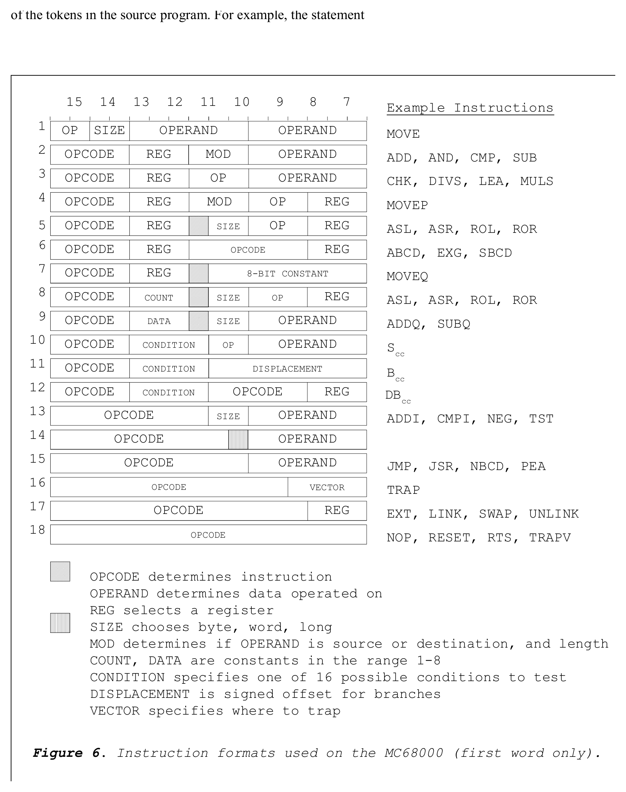

# Chapter 4. Meta-Assemblers


## 4.1. The Need for Meta-Assemblers

For every new processor introduced, a corresponding assembly language is also introduced. This assembly language provides a means both to program the new processor and also to provide a programmers model of the processor (a hardware description). This assembly language may be a derivation of an earlier assembly language (such as the assembly language for the Motorola MC680x0 series of processors), although it is more likely to be a completely new assembly language. To program this new processor, therefore, requires an assembler. This is a program that translates the mnemonic, human-readable assembly language into a binary machine code, which can be subsequently executed by the processor. For nearly every new processor introduced a new assembler must therefore be coded.

An assembler is quite a complicated program, and consequently can take man-months to produce. In the early days of computing, this was not considered a problem because of the relatively small number of processors in use. However, this situation changed dramatically with the introduction of the microcomputer. A proliferation of microprocessors emerged, each one requiring an assembler.

This proliferation of new processors led researchers to explore the concept of the meta-assembler. This is essentially a software tool which aids the construction of new assemblers, by automating much of the design and implementation.

The roots of meta-assemblers stretch back, however, to before the introduction of the microcomputer. Ferguson26 mentions in his report on meta-assemblers that many of the ideas behind them were being considered back in the mid-1950's, although at that time meta-assemblers were being used for a different purpose. High-level languages had not yet been invented, so the highest generation of language processor was the meta-assembler. This provided a higher level of programming than the basic assembly language by incorporating concepts such as macros and procedures to define the assembly language specific operations in an independent form. These meta-assemblers developed from the concepts of automatic programming and universal coding. Ferguson discusses one of the first meta-assembler implementations, called UTMOST, which was introduced in 1962. Several other implementations are also mentioned, including FAP (Fortran Assembly Program), SLEUTH, META-SYMBOL and METAPLAN. These, together with other more recent implementations are discussed in Section 4.7.

## 4.2. Features of Meta-Assemblers

Skordalakis, in his article describing meta-assemblers24, puts forward five features of which an ideal meta- assembler should posses. These are:

1. Portability. The programming language used to code the meta-assembler should be one which is easily transported between many different computer systems. Traditionally, third generation high level languages have met these criterion best because (a) they are relatively machine independent and (b) they are available on a wide range of systems. The usefulness of a meta-assembler is obviously enhanced immensely if it can be used on a number of computer systems. Portability also allows the possibility suggested by Ferguson26 that advantages can be made by assembling for a processor using the same processor.

2. Ease of Use. This is referring to the ease with which a new assembler can be developed. Meta-assemblers which require the assembly language definition to be supplied in the form of a program are generally regarded as more powerful but also more difficult to use15. Obviously, the man-effort required to produce an assembler using a meta-assembler must be significantly less than the effort required to produce a dedicated assembler for the same processor. A number of alternative methods of expressing the assembly language definition have been devised (see Section 4.7, Implementations).

3. Power. This criterion refers to the power of the assemblers which can be produced by a meta-assembler. The power of an assembler is difficult to measure, but a number of features are generally regarded to constitute a powerful assembler (see Section 4.4, Assembly Language).

4. Non-restrictive. The possible range of syntactic and semantic structures which can be included in assembly language programs that can be assembled by the assemblers that can be implemented with a meta-assembler should ideally be unlimited. Program based meta-assemblers are generally the most non-restrictive because of the flexible method by which an assembly language can be defined. More restrictive is the Universal Cross Assembler or Table-Driven Assembler because of the limited variations which can be expressed in tabular form.

5. Generality. This feature is really related to the last. Skordalakis in his report also considers microprogram assemblers which are used to assemble programs which form the microcode of a processor. By generality, he means that an assembler can handle both conventional level assembly programs and microcode assembly programs (there are great differences in the format of the object code produced).

Skordalakis mentions that he had, at that time (1983), not come across any meta-assembler which possessed all these ideal qualities.

## 4.3. Meta-Assembler Classification

The classification of meta-assemblers was detailed by Skordalakis in his report on meta-assemblers24. Figure 1 shows the classification of the more general term assembler, which incorporates both dedicated assemblers and meta-assemblers. A dedicated-assembler is the traditional view of an assembler, i.e., one which has been coded specifically to assemble one assembly language and cannot easily be adapted to assemble another. The principles of operation of the dedicated assembler are shown in figure 2.

Meta-assemblers can be divided into a number of categories. The first selection depends on the time at which the meta-assembler becomes dedicated to a specific assembly language. A compile-time meta-assembler, as its name suggests, becomes dedicated at compile-time. The assembly language specifics must be contained in a manner which is incorporated into a meta-assembler shell, which contains the code for the assembly-language- independent components of the meta-assembler. The definition of the assembly-language-specifics might be contained in source code statements, tables or a mixture of both.

Meta-assemblers which are dedicated at run-time, like any system which incorporates late-binding of components, tend to be more complicated to implement9. There are two types of run-time dedicated meta-assembler, the generative type and the adaptive type. The principles of operation of these two types are shown in figure 3 and figure 4. In a generative meta-assembler the assembler description is used to produce a dedicated assembler based on that description. A number of dedicated assemblers can therefore be produced by one meta-assembler by writing many assembler descriptions. The adaptive meta-assembler, on the other hand, takes the assembler description file and adapts itself to mimic the corresponding dedicated assembler. Thus, although many assembler descriptions are required there is only one assembler program.

The adaptive assembler can furthermore be broken down into two types, depending on the method used to describe the assembler to the meta-assembler. In a Ferguson-Type assembler the assembler description takes the form of a macro language. Where this description takes another form it can be classed as a non-Ferguson assembler. This distinction is made because in Fergusons' report26 he uses the term meta-assembler solely to describe Ferguson- Type meta-assemblers.

## 4.4. Assembly Language

It is now appropriate, before going onto meta-assembler construction, to discuss the properties of assembly language and object code formats. The construction of these obviously has a direct influence on the way in which a meta-assembler must operate to turn one into another.

### 4.4.1. Assembly Language in Context

Assembly language is just one type of language in a sequence which have developed in parallel to the development of computers. The characteristics of these languages can be used to summarise the type of language by putting it into a group according to the relationship between the language, the problem to be solved and the machine on which it is to be solved. These levels of languages are summarised below;

The lowest level language, microprogramming, is not usually used to present problems to a microcomputer but rather to implement the computer itself. As such, they are specialised and not of general interest.

```
                  ASSEMBLERS
       DEDICATED                                        META- AS-
       ASSEMBLERS
                              COMPILE-                                 RUN-TIME
                                TIME                                     DEDI-
                                                    GENERATIVE                        ADAPTIVE
                                                       TYPE                            TYPE
       Figure 1. Meta-Assembler
       Classification.
```

```
                                                              FERGUSON                NON-FERGUSON
                                                                TYPE                      TYPE
```

Binary machine languages contain the actual bit patterns for each operation and data element in the problem to be solved. They are directly executable by microcomputers, but prove very difficult for humans to comprehend. For the earliest computers, this was the way in which they were programmed, but the development of the assembler provided a higher level language to specify the problem to be solved, the basic assembly language.

```
                                     SOURCE
                                     ASSEMBLY
                                     PROGRAM
                         DEDICATED
                         ASSEMBLER
                                    OBJECT                     Figure 2. Dedicated
                                    CODE                       assembler operation.
```

```
                                                              META-                         DEDICATED
          ASSEMBLER DESCRIPTION                             ASSEMBLER                       ASSEMBLER
             Figure 3. Generic Meta-
               Assembler Operation
```

The assembly languages (basic and macro) presents the programmer with a human-readable form of binary machine languages. It does this by assigning mnemonic representations to binary commands and decimal/ hexadecimal equivalents of binary numbers. Because of the close relationship between assembly languages and machine languages, most microcomputers have their own specific assembly language. This is used to describe a problem and its solution in terms of the specific resources that a computer is able to offer. Macro-based languages are more powerful in that they allow many basic assembly language instructions to be grouped and manipulated as single entities.

Procedural-Oriented (high level) programming languages abstract from the implementation details and allow the specification of the solution to a problem to be made without regard to the computer on which it is operating. This is an ideal description to which languages such as Pascal, Modula-2 and ADA, amongst others, achieve with a high level of success.

Very high level functional programming languages (such as PROLOG) allow a problem to be specified without regard to its solution. The microcomputer is responsible for providing the means and solution to the problem. There are currently few languages which meet this specification.

```
                                                                      SOURCE
                                                                      ASSEMBLY
                                                                      PROGRAM
                                                                                PROGRAM LISTING
                                                              META-
          ASSEMBLER DESCRIPTION                             ASSEMBLER
            Figure 4. Adaptive Meta-                                  OBJECT
            Assembler Operation.                                      CODE
```

### 4.4.2. Assembly Language Structure

As was stated before, assembly languages relate directly in the way in which they are structured to machine languages and thus to individual processors. Each processor, therefore, requires an assembly language. As each processor has a different structure and set of facilities, the assembly languages are consequently different. Because of the historical development of assembly languages, however, their overall structure is generally very similar.

An assembly language program for virtually every processor can be broken down into two main structures. The first is an overall structure which contains a mix of assembly language dependant and independent features. The second is the most general structure the assembly language line or statement. The statement can have one or more fields which are separated either by whitespace or specially designated characters. One or more of these lines form an assembly program. The general structure of one of these lines is:

[LABEL] OPERATION OPERANDS [COMMENT] where optional fields are indicated with square brackets []. The optional label field is a symbolic name chosen by the programmer to represent the current memory location of a command. It could be used to identify the target of a branch instruction, the location of a data container or a procedure name. The label usually starts with an alphabetic character and can be followed by alphabetic characters, numeric characters or special characters such as the underscore (_). The label is separated from the rest of the statement by either whitespace or a colon. The significant length of the label varies between assembler implementations but is typically 8 to 30 characters long.

```
     Language Level                           No of language state-                             Genera-
     Very high level                          One to very many                                    4-5
                                              ments per machine                                 tion
                                              language instruction
     Procedural level                         One to many                                              3
     Macro-assembly level                      One to some                                             2
     Basic assembly level                      One to one                                              1
     Binary machine level                      -
```

The operation code is generally a short mnemonic name describing either a valid machine operation or an assembler directive. A machine operation describes a valid instruction to be executed by the target processor. An assembler directive is an instruction which tells the assembler to modify its operation in some way. Two types of assembler directive can be identified:

Assembler Independent - These are directives which are included in virtually all dedicated assemblers. The directives, although having varying formats, perform similar or identical functions. These include:

- Output listing control.
- Expression equates.
- Data block reservation/assignment.
- Assignment of code origin.
- End of input file marker.
- Expression evaluation default base.

Assembler Dependant - These are directives which refer to assembler features which match requirements in the object code to be produced. The object code being produced in turn depends on both the target processor and the operating system being used. Generally, assembler dependent directives are concerned with the correct structuring of code into blocks or procedures. The variability of assembler dependent directives is not limited to target processors, therefore, but also to different target operating systems.

Assembler directives are also known as pseudo-ops and pseudo-instructions.

The operands field contains one or more designations for data to be operated on, usually separated by commas. The maximum number of operands is determined by the target processor, except when dealing with assembler directives. Each operand may refer to one of three things, 1. A constant value. 2. A processor register. 3. A label.

Depending on the requirements of the machine instruction, one or more of these form an operand. Operands can also be formed by an expression consisting of one or more of the above (this depends on the capabilities of the assembler).

The last field, which is optional, is the comment. They are used by the programmer to imbed descriptions of the operation or meaning of the assembly language to the human reader and are consequently ignored by the assembler. Comments are usually separated from operands with either whitespace, a semi-colon, or both and they can appear on their own on an instruction line. Statement lines can also be blank.

## 4.5. Machine Language Formats

Each assembly language statement in the input file to an assembler, apart from assembler directives, is translated into a machine language instruction. The format of machine language instructions is determined by the target processor on which it will execute. The format is chosen by the processor chip designers and is based on a design criteria of their choosing. A number of important decisions are made which affect the format of the machine language1.

### 4.5.1. Design Criteria in Machine Instructions

The most important decision to be made is the possible range of instruction lengths to be used. Shorter instruction lengths (in number of bits) are desirable because they lead to both memory space and speed improvements.

A program consisting of n 16-bit instructions takes up half the memory space as n 32-bit instructions. Improvements in speed are made because the transfer rate from memory to processor is fixed by technological constraints. If the transfer rate of a memory device is t bits per second and the average machine instruction is r bits long then the memory device will, on average, deliver t/r instructions per second. The rate at which instructions can be executed by the processor is directly proportional, therefore, to the instruction length. Shorter instructions can be executed quicker than longer ones. As CPU's become quicker the amount of time required to fetch an instruction from memory becomes more significant.

There are a number of ways to overcome this problem (termed the 'Von-neuman bottleneck' after the inventor of this type of computer architecture) one of which is to reduce the number of bits required to describe an instruction.

The length of instructions should therefore be kept as short as possible. This factor must be offset by the number of instructions required. An n-bit word can only support 2n different instructions. This total must not only include all possible opcodes but also all possible memory locations to be addressed in the operands field of the assembly language instruction (see Figure 5).

The compromise made by many processor designers is to have more than one possible instruction length. The ideal processor would have very short instruction lengths for the most frequently used instructions with longer instructions being required less frequently. This ideal is limited in practice by the complexity of the most frequently used instructions.

Machine instructions including addresses are at once limited in length in that a minimum amount of space is required for the address in the instruction. Many processors overcome this problem by providing the same instruction with a number of possible address lengths. The assembler can therefore choose the minimum address length which is sufficiently large enough to hold the address required.

### 4.5.2. Layout of Machine Languages

The layout of machine languages is, as stated above, a product of the processor designers' design criteria. There are three general principles which machine languages can exhibit21.

Regularity.

This principle refers to the way in which information such as number of operands, data and address lengths, is encoded in the instruction. A high degree of regularity implies that the method for encoding information is consistent across the possible range of instructions.

Orthogonality.

A high level of orthogonality implies that any machine language instruction can be consistently broken down into a number of independent fields.

An example of an orthogonal machine language is that of the IBM 370 processor in which the first 8 bits of any instruction are always the encoded opcode. Data and addresses then follow in a consistent manner and give rise to only 5 possible instruction formats.

Composability.

This refers to the above two principles. It should be possible to compose orthogonal, regular notions in arbitrary ways.

It should be noted that while all these principles lead to a more intuitive instruction layout and simple assemblers, they give rise to longer instructions and therefore a reduction in efficiency both in terms of speed and memory usage (see the previous section).

The design criteria used determines the degree to which any particular machine language meets these ideals. The best way to identify possible machine language formats is by example.

The Motorola MC68000 Machine Language.

Figure 6 shows the method of encoding used for the first machine language word (16 bits) of the MC68000. The reason for there being so many different formats is because the MC68000 has a large number of possible instructions compared with the size of the word and there are therefore few bit patterns unused. The MC68000 designers, rather than opt for the principle of orthogonality, decided to allow more frequently used instructions more opcode space and therefore more flexibility on the number of variants possible. The MOVE instruction, which is the most important instruction in any machine language, is encoded using instruction format 1 (see figure 6). This instruction allows data transfers to take place between a number of possible locations including memory to memory, register to memory, memory to register and register to register. Immediate data can be transferred to both memory or registers. Almost 1/4 of the total possible bit combinations is taken with this one instruction alone.

With this fact in mind, it was clearly impossible to provide two 6-bit operands for all the other instructions. Most of the other instructions, therefore, have one general purpose 6-bit operand and a 3-bit register operand. So, for example, with the ADD instruction (format 2) it is impossible to add an operand located in memory to another in memory. One of the operands must be a register.

The squeeze of instructions into the 16 bits available is evident by the peculiar method with which some instructions are encoded. For example, the MOD field in instructions with format 2 distinguishes between operations on byte (8-bit), word (16-bit) and long-word (32-bit) operands as well as determining whether the operand refers to the source or destination of the instruction. As this only needs 3 X 2 = 6 possibilities and the 3- bit MOD field allows for 8 possibilities, the other two MOD values are used to indicate completely different instructions.

Another good example of the full use of the first 16-bits of any instruction is the similarity of the four instructions Scc, DBcc, ADDQ and SUBQ (see figure 7).

All four instructions have the same bit pattern in the upper (12-15) four bits. The latter two instructions are distinguished from the upper two by the presence of the 3 in the SIZE field. This is an illegal size in the ADDQ and SUBQ instructions. The separation of the Scc and DBcc instructions is even more difficult as potentially each can have the same 16-bit combinations. This problem is overcome by making MODE = 1 in the Scc instruction illegal, thus giving the DBcc instruction an allowable bit pattern.

It can be seen that the MC68000 instruction set, while providing some degree of orthogonality, is definitely not regular as special cases of some fields give rise to completely different instructions. It follows that the instruction set is not very composible either. All these factors, while working to the advantage of more instructions in the same instruction space, inevitably lead to more complicated assemblers and compilers. Special cases have to be taken into account in a fully implemented assembler, although relatively simple assemblers can be written if a number of the more complexly encoded instructions are ignored1.

The Zilog Z80 Machine Language.

```
                                                        Opcode
                                                          (a)
```

```
                                  Opcode                        Address
                                                          (b)
```

```
                                  Opcode            Address 1             Address 2
                                                          (c)
```

```
              Figure 5. Three typical instruction formats: (a) zero-
              address instruction. (b) one-address instruction. (c)
              two-address instruction.
```

The format of the Z80 Machine Language is neither regular, othorgonal or composible. This is mainly due to the decision taken by the Z80 designers that it should be bit-compatible with the earlier 8080 processor which in turn was semi-compatible with the 8008 processor (which was an 8-bit version of the 4004!). This meant that all the new Z80-specific instructions had to be encoded using the spare opcode patterns of the 8080 processor, because the Z80 had to be able to run unmodified 8080 programs. The instruction formats which resulted are obviously more complex than they would have been if they had been designed from scratch. In total there are 26 possible instruction formats.

Unlike the MC68000, the length of Z80 instructions is not fixed by the length of data being operated on. Instead, the length of an instruction is mainly determined by its frequency of use. Thus frequently used instructions (such as a data move from one register to another) are encoded using only 8 bits whereas less frequently used instructions can be up to 32 bits long. The advantage of designing a machine instruction set this way was discussed earlier in the previous section, mainly that memory usage and instruction transfer times from memory to processor are reduced. The main disadvantage is that instructions generally take longer to decode.

Assemblers and compilers for the Zilog Z80 processor are necessarily even more complex than those for the MC68000. The special cases which must be considered include all the new Z80-specific instructions.

## 4.6. The Assembly Process

The purpose of an assembler is to translate a source program in assembly language into an object program in machine language (see figure 8). The method by which this translation occurs is very data-oriented in that what is essentially happening is the transformation of data. The assembly process can therefore be broken down into a number of phases, each one of which performs transformation on some input to provide output. Comparisons can be made between the phases of an assembler and the phases of a compiler. An assembler is, in effect, a simple compiler.

Watson14 identifies two broad sub-tasks which must be performed by a compiler.

1. The analysis of the source program.
2. The synthesis of the object program.

In the case of an assembler, the source program is written in the assembly language of the target processor and the object program is written in the machine language of the target processor.

The analysis task can be broken down into three phases:

1. Lexical Analysis.
2. Syntax Analysis.
3. Semantic Analysis.

The synthesis task is usually considered as a single code-generation phase (see figure 9).

The interface between the phases of an assembler can vary between different implementations. Each phase could, for instance, be a separate program transforming an input file into an output file. Such an assembler would be a four-pass assembler since four passes are made over various versions of the source program. Four-pass assemblers are not very common, however, because they are extremely inefficient. A much more efficient way of providing the interface between phases is via data structures containing tokens. A token is a basic syntactic component of the input language of which four were identified in section 4.4.2. These are:

1. Label.
2. Operation.
3. Operand(s).
4. Comment.

These could be passed either individually or in groups between the phases of an assembler. The most convenient grouping is that of an assembly language statement. In this way, two-pass and one-pass assemblers are possible which avoid the need to read and write several versions of the source program.

The decomposition of an assembler into distinct phases has a number of advantages, not least of which is that it makes the task of writing what is a large program easier. The other major advantage of decomposition in this way is that all but the code generation phase can be made machine language independent. Thus it can be seen that this introduces some of the properties of meta-assemblers.

### 4.6.1. Lexical Analysis

The task of the lexical analyser is to read characters from the source program and group them into basic syntactic components which can be passed onto the syntax analyser as tokens.

In an assembler this task becomes fairly trivial because of the small number of syntactic components used and the rigid structure which is imposed on them. The lexical analyser takes the free-format source program and extracts tokens by ignoring all whitespace (space and tab characters) and comments (these are not needed by subsequent phases).

The output from the lexical analyser could take a number of forms. It might produce pointers to the start of each of the tokens in the source program. For example, the statement 15 14 13 12 11 10 9 8 7 Example Instructions 1 OP SIZE OPERAND OPERAND MOVE 2 OPCODE REG MOD OPERAND ADD, AND, CMP, SUB 3 OPCODE REG OP OPERAND CHK, DIVS, LEA, MULS 4 OPCODE REG MOD OP REG MOVEP 5 OPCODE REG SIZE OP REG ASL, ASR, ROL, ROR 6 OPCODE REG OPCODE REG ABCD, EXG, SBCD 7 OPCODE REG 8-BIT CONSTANT MOVEQ 8 OPCODE COUNT SIZE OP REG ASL, ASR, ROL, ROR 9 OPCODE DATA SIZE OPERAND ADDQ, SUBQ 10 OPCODE CONDITION OP OPERAND Scc 11 OPCODE CONDITION DISPLACEMENT Bcc 12 OPCODE CONDITION OPCODE REG DBcc 13 OPCODE SIZE OPERAND ADDI, CMPI, NEG, TST 14 OPCODE OPERAND 15 OPCODE OPERAND JMP, JSR, NBCD, PEA 16 OPCODE VECTOR TRAP 17 OPCODE REG EXT, LINK, SWAP, UNLINK 18 OPCODE NOP, RESET, RTS, TRAPV OPCODE determines instruction OPERAND determines data operated on REG selects a register SIZE chooses byte, word, long MOD determines if OPERAND is source or destination, and length COUNT, DATA are constants in the range 1-8 CONDITION specifies one of 16 possible conditions to test DISPLACEMENT is signed offset for branches VECTOR specifies where to trap



*Figure 6. Instruction formats used on the MC68000 (first word only)*

Start: MOVE D0, D3 ;comment ^ ^ ^ Label Operation Operands would produce three pointers to the start of the label, operation and operand fields. These could be CARDINAL numbers representing the position in the source line or could be POINTERs TO CHAR.

Another method of expressing the output of the lexical analyser could be to fill a data structure with copies of the fields in the source program line. Given a declaration of a RECORD structure TYPE String = ARRAY [1..30] OF CHAR;

```
    ADDQ        0       1    0      1          DATA          0      SIZE            MODE               REG
    SUBQ        0       1    0      1          DATA          1      SIZE            MODE               REG
      Scc       0       1    0      1         CONDITION            1     1          MODE               REG
      DBcc      0       1    0      1         CONDITION            1     1      0     0     1          REG
                             Figure 7. Four MC68000 Instructions.
```

```
    LexOutput       = RECORD
                            Label            : String;
                            Operation : String;
                            Operands         : String
                        END;
```

VAR CurrentLine : LexOutput;

the following assignments would be made by the lexical analyser:

CurrentLine.Label := "Start"; CurrentLine.Operation := "MOVE"; CurrentLine.Operands := "D0, D3";

The advantage of the first method is that duplication of data is avoided but subsequent phases in the assembly process will have to determine where tokens end. The second method provides tokens as separate entities but sacrifices memory to do so.

Errors produced by the lexical analyser relate to the way in which tokens are formed. They might include:

- Label starts with a non-alphabetic character.
- Operation contains non-alphabetic characters.
- Unexpected end of line.

### 4.6.2. Syntax Analysis

The syntax analyser must decide how to group tokens given to it by the lexical analyser. With assembly languages, the tasks of the lexical analyser and the syntax analyser are very difficult to distinguish because tokens come in only one group, the statement. Whereas the output of the syntax analysis phase of a compiler would probably be a parse tree, this phase in an assembler essentially produces the same output as the lexical analysis phase. However, although the data may not change from input to output an important operation still takes place. This is the checking of the source code for syntax errors. These are errors in the structure of the source program. Examples could be * Unknown operations. * Illegal numbers of operands.

### 4.6.3. Semantic Analysis

In a compiler, the semantic analysis phase determines the meaning of the source program. It translates the groups of tokens produced by the syntax analyser in the form of a parse tree into a linear sequence of instructions in an intermediate language.

In an assembler, the semantic analyser performs a number of tasks.

```
        TST.L D0
                                                                                          01001010
                                                                                          10000000
                                               TRANSLATOR
                                      INSTRUCTION TRANSLATION
                                 Figure 8. The Assembly Language
        ASSEMBLY                       Translation Process.                               MACHINE
        LANGUAGE                                                                          LANGUAGE
        PROGRAM                                                                           PROGRAM
```

1. It must extract information about the operation such as the type (either assembler directive or machine instruction) and the valid number and type of operands.

2. Operands must be decoded to determine their addressing mode. A cross-check is made between the addressing modes of the operands and the addressing modes which are legal to the operation being performed.

3. Operands must be evaluated. This involves expression evaluation where arguments could be labels or constants in a number of different bases, and where operations could be arithmetic or logical.

Errors produced might include:

- Invalid expression.
- The wrong use of labels.
- Bad addressing modes.

```
             lexical                  syntax                 semantic                  code
             analysis                analysis                analysis               generation
```

source object program program Figure 9. Phases of the Assembly Process The output of the semantic analyser of an assembler could take the form of a more detailed structure similar to the one produced by the lexical analyser, with fields for 1. Operation mask (if appropriate). 2. Operation type (assembler directive or machine instruction). 3. Operand values. 4. Operand types (in terms of addressing modes).

### 4.6.4. Code Generation

The final phase of the compilation process is to take the output from the semantic analyser and produce a machine code program which is ready to execute on the target processor.

In a compiler this involves translating the intermediate code generated by the semantic analyser and substituting these with the appropriate sequences of machine language instructions.

In an assembler, the process is simplified in that each of the 'intermediate instructions' produced by the semantic analyser maps directly onto one machine language instruction. Machine instructions are created by taking each element in the data structure produced by the previous phase and slotting them into the correct position. Conversion of operands into formats required by the target processor (e.g., twos complement integers) might also be required. The code generator calls on inbuilt knowledge to determine, for example, where operands should be placed.

When a machine instruction is completely assembled it is entered into the output object code program which imposes some form of structuring. This must also be done in the code generation phase.

Whereas optimisation might take place in the code generator of a compiler, this is a very small part of an assembler. Any optimisations which can be made by the assembler usually only have a small effect on the efficiency of the code produced. Examples of optimisation which are possible are usually restricted to substituting a more efficient version of a machine instruction for another.

### 4.6.5. A Simple Two-Pass Assembler

It is now appropriate to give an example of the way in which the phases of an assembler are brought together form a complete assembler.

The correlation between the passes and the phases of an assembler is somewhat ambiguous. This is mainly because the development of assemblers has lead to the most efficient implementations which do not necessarily match the idealised model of an assembler.

Most assemblers require two-passes because of the forward reference problem. This occurs because of the sequential way in which the assembler scans the source program. Most assemblers use the group of tokens which form a statement in the source program as their method of communicating between the assembly phases. Each phase works on one statement and then passes this onto the next phase. This is done because of the high overhead required to read and write many intermediate files. The forward reference problem occurs when an assembly language statement refers to another later on in the source program. This forward reference usually takes the form of a label which has not yet been defined. Consider the MC68000 program in figure 10.

The assembler will begin by defining the symbol Start and inserting it in a symbol table. The symbol table contains the names of symbols together with their values. In the case of the symbol Start, its value would be zero because the Instruction Location Counter (ILC) is reset to this at the start of the assembly process. The compare instruction is then assembled and its machine code equivalent inserted in the object program. The ILC is incremented by the length of the current instruction. When the assembler analyses the operand in the next instruction it finds that it cannot give it a value because the label NotEqual has not yet been defined. The easiest way to satisfactorily resolve this problem is to have all symbols in the source program available with their values before the assembly process begins. This is what gives rise to the first pass on a two pass assembler.

If the problem is regarded conceptually from the point of view expressed in the previous section (i.e., assembly by phases) then the phases of lexical analysis, syntax analysis and semantic analysis are repeated twice during assembly. All the phases are needed during the first pass because a preliminary analysis of the operation and operands in a statement is required in order to determine the instruction length. This is needed in order to increment the ILC by the correct amount. The output from the first pass of the assembler is a symbol table. Logically, this should be in addition to a data structure containing all the assembly language statements in a decoded form (similar to the output of the syntax analyser in section 4.6.2.). However, the overhead in maintaining two files of data is usually considered greater that the extra time necessary to perform all these stages again in the second pass. No intermediate file is generated between passes, therefore, and the second pass re-reads the source file but with the values of all symbols in it defined.

Figure 11 gives a procedural example of what the first pass of a two-pass assembler could look like. Apart from the symbols defined as labels for statements, most assemblers allow the explicit definition of symbols using an assembler directive. So, for example, the statement BufferSize EQU 256 tells the assembler to store the symbol BufferSize in the symbol table with value 256.

The Instruction Location Counter managed by the assembler can usually be referred to in the source program via a special symbol, a common example being the asterisk character. The value of the ILC can be explicitly modified in the source program by using an origin directive. The statement ORG 2000 sets the value of the ILC to 2000. This allows programs and parts of programs to be located anywhere in memory.

The second pass of the assembler performs the complete set of phases described previously to translate the source program into the object program, with the source program being accompanied by a complete symbol table. Figure 12 gives a similar procedural view of the second pass.

The semantic analyser makes use of an opcode table which contains details about all the machine language instructions available on the target processor. Details include:

1. The mnemonic name of the instruction.
2. The basic length of the instruction (which may be modified by the size of the operands on some processors).
3. A basic mask containing all the bits set by the instruction opcode on its own.
4. The class of instruction. This corresponds to one of the possible formats which the instruction can take (see section 4.5.2.).

When operands have been evaluated with an expression evaluator (which uses the symbol table where necessary) they can be added to the opcode mask by an instruction-format-specific routine selected with the class of opcode indicated above.

## 4.7. Implementations

In this section various implementations of meta-assemblers which have been developed are described. This will be done in chronological order so as to give a mini-history. It can be seen that meta-assemblers and their purpose for being developed has evolved from the early days of computing up to the present.

### 4.7.1. Early Implementations

Published reports on early implementations of meta-assemblers are limited to one written by Ferguson in 196626. In this report, titled 'The Evolution of the Meta-Assembly Program', Ferguson details both the origins of meta- assemblers and early implementations. His view of meta-assemblers and later views are significantly different because of the way in which they were being used at that time. They were, in effect, low-level languages being described using high-level language constructs. This allowed direct access to machine-specific operations via a higher level than was currently being provided by assembly languages. The method used to provide this functionality included the many-to-many macro (as opposed to the one-to-many macro common in most macro- assembly languages today) which was referred to as procedures and functions. The consequence of being able to express machine-dependent features in a high-level way was to significantly reduce the problems associated with writing programs for more than one processor. A side-effect of this also made it possible to convert programs written for one processor into a form which could be assembled for another.

A report by the United States Navy in 1954 contained a discussion on many of the ideas involved in meta-assembly. The report was on automatic programming, a concept which together with universal coding provided the basis of the principles behind meta-assemblers. The first program which could truly be called a meta-assembler was UTMOST which was completed in 1962. It allowed the description of the relationship between the assembly and machine languages of a processor to be described in terms of procedures with generalised arithmetic expressions and lists for parameters. An implementation called FAP (FORTRAN Assembly Program) introduced the concepts of a relocatable location counter and the external symbol which are used in both meta-assemblers and dedicated assemblers today. A later implementation of UTMOST called SLEUTH expanded on the procedure concept by the introduction of the function i.e., a value returning procedure. META-SYMBOL, an implementation for the SDS 900 series of computers, added on the SLEUTH implementation by generalising the list concept even further and by the introduction of a new method for encoding symbolic information into binary. This significantly reduced the volume of information required to describe any particular assembler specification. An implementation of a meta-assembler for the Spectra-70 series of computers introduced the many-to-many macro which enabled it to efficiently translate any source program written in METAPLAN (META Programming LANguage).

A book written by D.W.Barron called Assemblers and Loaders2 which was first published in 1969 has a chapter on meta-assemblers, in which he comments on Ferguson's report. Barron makes the important point that the syntax of the input programs to all the meta-assemblers described by Ferguson is fixed. So, although these meta- assemblers could be configured to assemble for virtually any machine (at the time) they could not assemble programs written in the assembly language provided by the processor's manufacturer. Later implementations address this problem.

So, with all the meta-assemblers up to 1969 (to my knowledge), the assembly process looked somewhat like figure 13. The main difference, therefore, between these early meta-assemblers and later implementations is that both the assembler specification and the program to be assembled were in the same file. The assembler specification took the form of normal source statements where the operation field is interpreted as a procedure call with the operands field being interpreted as parameters to that procedure. Symbols defined in expressions which made up the operands could take either normal symbolic values or could be names of functions which were described in the source file and were, in turn, evaluated by the meta-assembler. Predefined procedures and functions allowed the construction of the output object file and listing file. This process is described in more detail in section 4.7.5.

### 4.7.2. CASS-8: A Universal Cross Assembler

The re-interest which was expressed by software developers in the concept of the meta-assembler in the late 70's came about because of the proliferation of microprocessors. This was the basis for the development of CASS-8, a cross assembler suitable for most of the 8-bit microprocessors16. As regard to microprocessors, two main areas led to the need for meta-assemblers.

1. In educational environments, where many processors are being studied, it is prohibitively expensive to buy manufacturer's assemblers and cross-assemblers for every processor. Another factor is the many different quirks and small differences in syntax found between dedicated assemblers, which throw students into some degree of confusion when several dedicated assembly languages must be learn in a short period of time.

2. In development environments, where engineers develop systems using many different processors. Once again, cost is a major factor not only in buying many dedicated assemblers but also in retraining staff to use all these assemblers.

The CASS-8 assembler was developed to solve problems in the first environment above. It is a table-driven assembler in that the relationship between the assembly and machine languages of a processor is described as a set of tables. This is input into the meta-assembler in the form of a separate file to the program to be assembled. This assembler specification contains the following information for each machine language instruction.

1. The mnemonic of the instruction.
2. The operation code of the machine language instruction (opcode bit-mask) corresponding to the mnemonic above.
3. The type of operands which are legal for this instruction.
4. The number of machine cycles required for execution of the instruction.
5. A flag indicating whether the instruction gives rise to a branch condition.
6. An optional descriptive comment.

As the second field is only one byte in size, only 8-bit processors can be assembled to. The source language is an adaptation of any manufacturer's assembly language in that the operation code must contain the instruction's concerned register (if applicable) and the addressing mode to be applied. This significantly reduces the amount of lexical analysis required because the addressing mode of any instruction is instantly known when the assembler mnemonic is retrieved from the opcode table. All the assembler dependent features are therefore described using data (as opposed to algorithms). This tends to lead to an easier implementation but also to inflexibility in the variety of processors whose machine and assembly languages can be translated. This is reflected in the fact that only 8- Line Label Opcode Operands 1 Start CMP #10,D0 2 BNE NotEqual 3 CLR D0 4 BRA.S Continue Figure 10. The 5 NotEqual ADD #15,D1 forward reference 6 Continue RTS problem.

bit processors are catered for and even then some are not applicable. This is because of the strict structuring imposed on the object code generated, which must be of the form of a 1 byte opcode followed by a 0, 1 or 2 byte operand. Eight bit processors which do not conform to this format of object code include the Signetics 2650 and Zilog Z80.

Figure 14 gives an example of the sort of entries required in an assembler specification file for the Motorola M6800 processor instruction set.

### 4.7.3. A General Purpose Cross-Assembler for Microprocessors

This is a similar type of meta-assembler to the one above, developed by S._Fujita and K._Yoshida of the Yokoshuka Electrical Communication Laboratory at around the same time17. It is an implementation which is table driven but the assembler specification is in the form of a program which is processed to produce a set of tables. A MASP (Meta-language Assembler SPecification) is converted into a MAST (Meta-language Specification Table). A general purpose assembly program then uses different MASTs to assemble programs for different microprocessors. The principle is shown in figure 15. In this case, both the source language and the corresponding machine language must be specified in the MASP. This means that the general purpose cross assembler can mimic manufacturer's dedicated assemblers. MASP is designed to enable the description of delimiters, mnemonic opcodes, number of operands, expression types of operands and the determination of evaluated value of operands. The assembler directives are kept predefined (assembler-independent) to improve the efficiency of the assembly process.

The report on the meta-assembler concludes by describing the success with which different microprocessors could be described in MASP. Out of 28 processors tested, 26 could be described in some way and 22 (see figure 16) could be described to produce an exact replica of the manufacturer's dedicated assembler (excluding assembler directives). The shortness of MASP descriptions reflect the speed at which they can be produced. Approximately 1/100 of the man/hours is required and 1/60 of the source lines (compared with the development of a dedicated assembler for the same processor). Figure 17 shows the length of MASP files for various processors.

### 4.7.4. UOPCA - A Table Driven UCA Written in BASIC

A report by J. Robert Heath and Shailesh M. Patel published in 1981 details their work on the development of a universal cross-assembler in BASIC19. The concepts behind the structure of the assembler are very similar to those of Fujita and Yoshida17. Being table-driven, restrictions on the source and object syntax are proportional to the complexity of the assembler description tables employed. The assembler differs from the other implementations in that it takes only one pass to assemble any source program (hence UOPCA - Universal One-Pass Cross- Assembler). When the UOPCA encounters a forward reference the instruction is flagged in a temporary file. When the single pass of the source program has been completed the temporary file is read and previously unknown references are now known and can be successfully assembled and written to the object file.

The implementation which was written was an experimental version of the full UOPCA design. As such, error checking, the number of assembler description files and the ability to handle complex machine instruction formats (especially on 16-bit processors) was compromised. The format of the opcode tables also places less obvious restrictions, such as the maximum addressable memory space of only 65536 (64_Kbytes). The structure of the tables rely heavily on the orthogonality of target machine languages. Figure 18 shows the format of the assembler description file. It can be seen that restrictions are also made by the file structure, such as the number of register PROCEDURE PassOne; (* This procedure is an outline of pass one of a simple assembler. *)

CONST size = 8; EndStatement = 99;

VAR ILC, class, length, value: INTEGER; MoreInput : BOOLEAN; literal, symbol, opcode : ARRAY [1..size] OF CHAR; line : ARRAY [1..80] OF CHAR;

BEGIN ILC := 0; (* Initialize Instruction Location Counter *) MoreInput := TRUE; (* Set to FALSE at END directive or EOF *) InitializeTables; (* Call a procedure to set up tables *)

WHILE MoreInput DO (* Loop executed once per line *) ReadNextStatement(line); (* Go get some input *) SaveLineForPassTwo(line); (* Save the line *)

IF LineIsNotComment(line) THEN (* Is it a comment? *) CheckForSymbol(line, symbol); (* Is there a symbol? *) IF symbol[1] <> ‘’ THEN (* If column 1 blank, no symbol *) EnterNewSymbol(symbol, ILC) END; LookForLiteral(line, literal); (* Literal present? *) IF literal[1] <> ‘’ THEN (* Blank means no literal present *) EnterLiteral(literal) END;

```modula-2
     (* Now determine the opcode class. -1 used to signal illegal opcode. *)
     ExtractOpcode(line, opcode);
     SearchOpcodeTable(opcode, class, value);
     IF class < 0 THEN
       TryPseudoInstr(opcode, class, value)
     END;
     length := 0;                       (* Compute instruction length               *)
     IF class < 0 THEN
       IllegalOpcode
     END;
     CASE class OF
       0: length := type0(line) |       (* Compute instruction length               *)
       1: length := type1(line)         (* ditto                                    *)
```

```
       (* Other cases here *)
     END;
```

```modula-2
      ILC := ILC + length;
      IF class = EndStatement THEN
        MoreInput := FALSE;
        RewindPassTwoInput;
        SortLiteralTable;
        RemoveRedundantLiterals
      END
    END
```

END END PassOne;

```
                   Figure 11. Pass one of a simple assembler.
```

equivalent values (a maximum of 19). This also assumes that the equivalent values for registers do not change between machine language instructions. The format of the object code produced is similar to that of the previous implementation described in that non-orthogonal processors such as the Zilog Z80 cannot be handled satisfactorily. Opcode tables have, however, been written for the Intel 8080 and the Motorola M6800.

This report differs from all others I have come across in that a complete listing of the experimental version of the UOPCA is included, as well as an example assembler specification file for the Intel 8080. Heath and Patel assume that for some processors modification of the assembler source program will be necessary (although not extensive).

### 4.7.5. XMETA - A High Level Language Based System for Cross-Assembler

Definition.

XMETA is a fundamentally different meta-assembler from those discussed so far. The assembler specification takes the form of a high-level language program. This approach addresses the problem of table-driven assemblers which is inflexibility in the assembler specification. The price paid for a more flexible system is in assembler complexity and the ease with which new assembler specifications can be written.

XMETA is extensively documented by its authors in two reports:

1. A High Level Language Based System for Cross-Assembler Definition23.
2. Experiences with the use of a Universal Cross-Assembler based on the IEEE Proposed Standard28.

The first report deals with the structure and operation of XMETA, while the second concentrates more on its ability to assemble programs written using the IEEE Assembly Language Standard (more details of which can be found in section 5.3.3.).

The author of the first report and one of the designers of XMETA, M. Anacona, goes into some depths about the possible methods which can be used to obtain a cross-assembler system (other than a table-driven approach). Among these are:

1. The use of Translator Writing Systems (TWSs).
2. The use of High-Level Languages (HLLs).
3. The use of Meta-Assemblers (Ferguson's definition).

Each of these possible approaches provide solutions to parts of the problem, but none provide a completely satisfactory answer.

Although Translator Writing Systems provide a good method of solving the problem, they are generally large and require a medium-to-large sized host computer. They are effectively an over-kill to the problem (being more in the realm of compilers).

High-Level Languages, such as Pascal, can be used to write very efficient implementations of dedicated PROCEDURE PassTwo; (* This procedure is an outline of pass two of a simple assembler. *)

```modula-2
     CONST
       size = 8;
       EndStatement = 99;
```

```modula-2
     VAR
       ILC, class, length, value: INTEGER;
       MoreInput                : BOOLEAN;
       literal, symbol, opcode : ARRAY [1..size] OF CHAR;
       line                     : ARRAY [1..80] OF CHAR;
```

```modula-2
     BEGIN
       ILC := 0;                              (* Initialize Instruction Location Counter *)
       MoreInput := TRUE;                     (* Set to FALSE at END directive or EOF    *)
```

```modula-2
     WHILE MoreInput DO
       GetNextStatement(line);              (* Get input saved by pass one                 *)
       IF LineIsNotComment(line) THEN
         ExtractOpcode(line, opcode);
         SearchOpcodeTable(opcode, class, value);
         IF class < 0 THEN
           TryPseudoInstr(opcode, class, value)
         END;
         length := 0;                       (* Compute instruction length                  *)
         IF class < 0 THEN
           BadOpcode
         END;
         CASE class OF
           0: length := eval0(line) |
           1: length := eval1(line)
```

```
           (* Other cases here *)
         END;
```

```modula-2
         AssemblePieces(code, class, value, operands);
         OutputCode(code);
         ILC := ILC + length;
         IF class = EndStatement THEN
           MoreInput := FALSE;
           FinishUp
         END
       END
     END
```

END PassTwo;

```
                       Figure 12. Pass two of a simple assembler.
```

assemblers. Modifications to a dedicated assembler written in a HLL to make it assemble for another processor usually involve only 20 to 30 percent of the source program. However, the modifications are scattered throughout the text of the source program and a comprehension of the operation of the complete assembler is required. This inevitably leads to an excessive amount of work which can only be performed by the author of the assembler or a programmer who is fully conversant on the operation of the assembler.

The benefits of using HLLs, however, are great. They include a systematic approach to development, greater understanding of cross-assembler structure, extensive debugging aids and lead to an implementation which is highly portable.

Translator Writing Systems also provide a systematic method of development and solve some problems such as syntax analysis and expression evaluation simply and immediately (as these features are already built in). The combination of the two (HLLs and TWSs) has very recently proved an effective solution32 (see section 4.8.7).

Anacona chooses the concept of meta-assemblers for his implementation, however, because of a number of factors.

1. Encapsulation of most of the details common to all assemblers, thus helping the implementor in several cumbersome problems.
2. Definition of (part of) the syntax and the semantics of the object language by accessing attributes through predefined functions, in an immediate, easy-to-use way.
3. Automatic definition and retrieval of macro libraries, each containing the definition for a particular cross- assembler.
4. Detailed control over code generation.

Previous implementations of meta-assemblers have been macro-based. This lead to a rigidity in the input syntax description, inefficiency, large memory requirements and an almost complete lack of portability between macro- libraries (assembler definitions). The greatest limitation of the implementations from the users point of view, however, was the choice of macros for assembler specifications: they have a cumbersome, non-standardised, unreadable and hard-to-understand syntax. While this was the level of language complexity around the time of Ferguson's report, no evolution had been made to reflect the developments made in high-level language design.

This fact, coupled with attempts made to standardise the syntax of assembly language programs lead to the development of the XMETA system. Its design includes the benefits of the three mentioned methodologies and uses a standardised assembly language syntax. This leads to an effective implementation written in a portable high- level language which means that it can be executed on both mainframes (as a universal cross-assembler) and microcomputer development systems (as a universal assembler).

XMETA Language.

Figure 19 shows the XMETA assembly process. It can be seen that it is an adaptive, non-Ferguson type meta- assembler (non-Ferguson in the sense that the assembler specification is not macro-based). The assembler specification is written in a Pascal dialect. Each assembly language mnemonic and assembler directive is described as a Pascal procedure with the same name. The procedures describe what action is to be taken to translate the assembly language instruction into a machine language instruction or what action is to be taken when an assembler directive is encountered. Each procedure can make use of built-in procedures and functions to analyse the source program statement and to generate object code, listing lines and error messages where appropriate.

```
                                                               META-                      OUTPUT
          ASSEMBLER DESCRIPTION                              ASSEMBLER
           AND SOURCE PROGRAM                                                             OBJECT
                                                                                          PROGRAM
                                                              LISTING
                                                               FILE
                        Figure 13. Early Meta-Assembler Operation
```

The language chosen for the first implementation of XMETA was kept to a minimum for the following reasons:

1. To select, at first, just what was considered indispensable, in order to implement extensions only when adequate feedback had been received.
2. So that the resulting implementation was kept as small as possible, easy-to-use and executable on microcomputer systems.

Features of the Pascal dialect used include:

1. Procedures and functions with associated parameters.
2. Integers which can be structured using one-dimensional arrays.

3. Character strings used in output instructions.
4. Numerical values specified in base 2, 8, 10 or 16.
5. if, while and case statements with structured goto's being performed using the exit statement.
6. Recursive procedure definition and calls.
7. A 'main program' which is executed at the start of the assembly process and allows the definition and initialisation of assembly variables.
8. Block structure and scope rules in block nesting.

Figure 20 shows the XMETA predefined functions which allow access to the assembly language source statement, which must conform to the IEEE standard25. The function Symbol returns a character string corresponding to the identifier requested, while all other functions return integer values. Arg, Xf1 and Xf2 return the results of expression evaluation while Pref1-Pref3 and Post return an integer representing the ASCII value of the single prefix/postfix character. A predefined value of nul is returned when the requested syntactic item does not exist.

Figure 21 gives an example of the values produced by these functions when applied to a typical IEEE-compatible assembly language statement. Because the symbol BETA has not yet been defined, Arg(1) returns an arbitrary value and Type(1) returns a flag indicating that this is a forward reference. The evaluation is deferred to a later fix-up routine when the value of BETA is known (after the first pass). This method, however, restricts the number of forward references allowable in any expression to one.

Other special purpose procedures and functions allow symbol table insertion, location counter definition and output of listing, code and error messages.

XMETA Structure.

The XMETA system is split into two Pascal programs each about 1200 lines long. One of the programs, XCOMP, compiles assembler descriptions into an intermediate, stack-based code. This is done because it would be inefficient for the main assembler to have to compile the assembler description file each time a source program is assembled. By precompiling assembler descriptions this overhead is avoided. As well as producing an intermediate code file, XCOMP also produces a list of all the level 0 (i.e., highest level) procedure names.

The second program, XASM, performs the assembly process. There are three main sections to this program:

1. A syntax analyser which analyses assembly source statements (see section 4.6.2.).
2. A semantics analyser which analyses the 'basic' semantics and encodes them into attributes (see section 4.6.3.).

3. An interpreter of the intermediate code corresponding to the assembler definition (this is the code generator - see section 4.6.4.).

The syntax and semantic analysers generate data structures from which the predefined procedures described above can be evaluated. The intermediate code which is interpreted can only access the results of the syntax and semantic processor identification number of instructions 6800 197 1 NOP 01 0 2 No Operation 2 TAP 06 0 2 CCR = A 3 TPA 07 0 2 A = CCR 4 INX 08 0 4 X = X + 1 5 DEX 09 0 4 X = X - 1 6 CLV OA 0 2 V = 0 7 SEV 0B 0 2 V = 1 meaningless mnemonic opera- operand execution comment sequence tion type time number code Figure 14. Sample part of CASS-8 Assembler Description File.

analysis via these predefined procedures. Other semantic structures (such as allocation counters, flags, etc.) are kept within the interpreter's global data area. Figure 22 shows the flow of control within the complete XMETA system.

The operation of the XASM program consists of a loop between the analysers and the interpreter. For every statement in the source program, the syntax and semantics analysers are employed to fill data structures with the decoded statement. If no errors occur during the analysis phase, control is passed to the interpreter which calls up the intermediate code procedure with the same name as the command in the assembly language source statement. This is interpreted and the remaining assembly actions are performed by the interpreter (code generation, listing control, etc.). At completion of the intermediate code procedure control is passed back to the analysers, which fetch the next source statement. This process is summarised in Figure 23.

Implementation Experiences.

The authors of the XMETA system have demonstrated its effectiveness and portability by implementing a number of assembler definitions and by transferring the system between different host computers.

Implemented processors : TMS1000, M6800, I8048, TMS9900, MC68000 and Z8000.

```
                      MASP Assembler
                       Specification
                            MASP
                                                                 Assembly Source
                         Processing
                                                                     Program
                          Program
                                                                       General
                      MAST Assembler                                   Purpose
                       Specification                                   Assembly
                                                                       Program
                                                                         Object
                 Figure 15. Configuration                               Program
                  of the General Purpose
                      Cross-Assembler
```

Supported host computers: PDP11/03, /23, /40, VAX11/780, PDT11/150, MINIMINC and microprocessor development systems.

The ease with which assembler definitions can be written is proportional to the experience gained using the system. An experienced XMETA programmer can code an assembler definition for a new processor in a few hours, most of which is spent reading documentation. The amount of debugging and testing time depends greatly on the Sort Microprocessor Name 4 bit 4004, 4040, uCOM4, uCOM41, PPS-4 8 bit 8008, 8080, M6800, MB8861, F-8, PPS-8, SCAMP, Z-80, COSMAC (CDP 1801/02)

```
             12 bit            TLCS-12, TLCS-12A, IM6100
             16 bit            PFL-16A, uCOM-16, LSI-11, TMS9900, CP-1600, PACE
```

Figure 16. Microprocessors to which the General Purpose Cross-Assembler is applicable orthogonality of the target processor and the complexity of the object code required. Detection of some errors also increases development time. By partitioning machine instructions into appropriate format classes (see section 4.5.2.) the debugging and testing time was reduced to an average of two days, which is comparable to the time required to debug and test a Pascal program of the same length.

```
           Sort          Microprocessor Name                   Number of Source Statements
           4 bit         4004                                  80
                         uCOM-4                                59
           8 bit         8080                                  110
                         M6800                                 266
                         F-8                                   143
          12 bit         TLCS-12A                              169
          16 bit         PFL-16A                               257
                         TMS9900                               204
    Figure 17. Number of MASP Source Statements required to describe an
                                 assembler.
```

The length of assembler definition programs compares favourably to the length of dedicated assemblers for the same target processor. A ratio of 3/5 was obtained when comparing with a dedicated cross-assembler written in Pascal for the TMS1000 processor, and a ratio of 1/4 was obtained when comparing with a dedicated cross- assembler written in XPL for the TMS9900 processor.

The speed of execution also compared favourably with that of a dedicated, two-pass cross-assembler thanks to pre-compiled assembler definitions and a one-pass assembly stage (with a quick fix-up scan for forward reference instructions).

### 4.7.6. MAUFI - A Meta-Assembler with a User Friendly Interface

MAUFI15 is an adaptive, non-Ferguson type meta-assembler which is table-driven. Unlike other table-driven meta-assemblers, however, the method used to enter assembler descriptions is user friendly. This reduces both the time and skill necessary to enter an assembler description. Figure 24 shows the structure of MAUFI.

PREPROCESSOR.

The preprocessor presents the user with a number of forms which together are used to form an assembler description. The selection of forms presented to the user varies depending on the users response to previous forms. The preprocessor builds up a database about the processor being described to it. This database is then used to configure the assembler stage so as to perform the correct translation process for the processor described.

The preprocessor groups the assembler description into a number of sections:

1. Code arrangement.
2. General syntax.
3. Constant syntax.
4. Registers/flags.
5. Addressing modes.
6. Instructions.
7. Pseudo operations (assembler directives).

Figure 25 shows the form for the Code Arrangement section. Some forms, such as this one, simply consist of fields which must be entered with the correct information. The Addressing Modes form, on the other hand, requires more detailed information in the form of simple equations.

Instructions are entered into the preprocessor one at a time and no preliminary grouping is necessary. For each instruction, the following information is required:

1. Mnemonic.
2. Machine code instruction bit mask.

```
                   0        Contains the value of the maximum user’s allotted
                            memory address (e.g., 65526).
```

```
                  1-5       Reserved for future assembler directives.
```

```
                  6-25      Various microprocessors register equivalent values
                            and equivalent codes for memory addresses (e.g.,
                            A 0000007 for Intel 8080).
```

```
                   26-      Each element contains:
                            Characters 1-4:             mnemonic code
                            Characters 5-7:             opcode value
                            Character 8:                process code for first
                                                        operand variable
                            Character 9:                process code for second
                                                        operand variable
                   26-      Characters 10-11:           instruction group code
                                                        number*
                (last-1)    ZZZ 0000000:                for illegal instruction
                                                        processing
                  last      **:                         to indicate end of the
                                                        data set file
          *e.g., MOV 0643003
          where,
            Characters 1-4           MOV is mnemonic name for the instruction MOVE
            Characters 5-7           064 is the opcode for MOV (base opcode)
            Character 8              3   is first process code for MOV, i.e., it will
                                         multiply the first operand variable by 2^3
                                         (first process code, i.e., 3) and add to the
                                         opcode value.
             Character 9             0   is the second process code for MOV, i.e., it
                                         will multiply the second operand variable
                                         by 2^0 (second process code, i.e., 0) and
                                         add to the opcode value.
             Characters 10-11        03 is the group code, i.e., this is 1-byte/2-
                                         operand-type instruction.
```

```
          Following is an example of the actual assembling process for MOV:
          LOOP: MOV       A,D     ; for Intel 8080 microprocessor
                                  ; register A = 7 and register D = 2
          Assembled opcode for the MOV A,D instruction equal to assembled opcode =
          (064 + 7*2^3 + 2*2^0)10 = (122)10 = (7A)16
                 Figure 18. Format of the assembler definition file.
```

3. Operation of instruction: Byte/Word/Long.
4. Number of operands.
5. Operand types.
6. Instruction length.
7. Instruction format.

ASSEMBLER.

The assembler is organised in the traditional two-pass configuration, pass one being concerned with defining all symbols and pass two doing the code generation.

An implementation of MAUFI has been written by its authors in the high level language C on a microcomputer based Unix system. A number of assembler specifications have been written, such as for the Zilog Z8000 and Motorola MC68000.

### 4.7.7. A Generative Approach to Universal Cross-Assembler Design

The latest report to be published on meta-assemblers (to my knowledge) is written by Peter Chiu and Sammy Fu of the Hong Kong Polytechnic32. They present a radically different approach to the meta-assembler problem. The approach incorporates high level language development tools and considers assemblers as high level language compilers. The result is an adaptive, compile-time dedicated meta-assembler, the structure of which is shown in figure 26.

By defining syntax rules at the source program stage (i.e., compile-time dedication) a much more flexible syntax can be obtained, enabling the production of assemblers which can accept the same source programs as a dedicated assembler. Two development tools, YACC and LEX, are used to simplify the generation of lexical and syntax analysers. Included with the 'modules' which contain the lexical and syntax analysers are other modules which can be placed into two broad categories. These are 'assembler-dependent' and 'assembler-independent' modules. To make up a complete assembler the following modules are required:

1. Main overall control module - independent.
2. Lexical analyser - dependent (on the assembly language).
3. Syntax analyser - dependent (on the assembly language).
4. Symbol table manipulation module - independent.

5. Error handling module - independent.
6. Instruction set module - dependent.
7. Directive handling functions module - dependent.
8. Coding module - independent.

The lexical and syntax analysers are dependent on the assembly language structure of the source program. It is possible with this system to write two assemblers for the same processor with different assembly languages by changing just the analyser modules and equally possible to use the same assembly language for two different processors (if this is physically possible).

Two primitive assemblers have been implemented by the authors of the report for the Intel 8086 and the Motorola MC68000. The results of extensive testing on the assemblers compared with dedicated assemblers and other universal cross-assemblers are shown in figure 27. It can be seen that the assemblers produced are 4 to 5 times slower than comparable dedicated assemblers and 2 to 3 times slower than comparable universal cross-assemblers.

Implementation time for a new assembler is quoted as about 20 to 30 days which is considerably longer than other implementations discussed earlier (although it is still substantially less than the time required to write a dedicated assembler).
