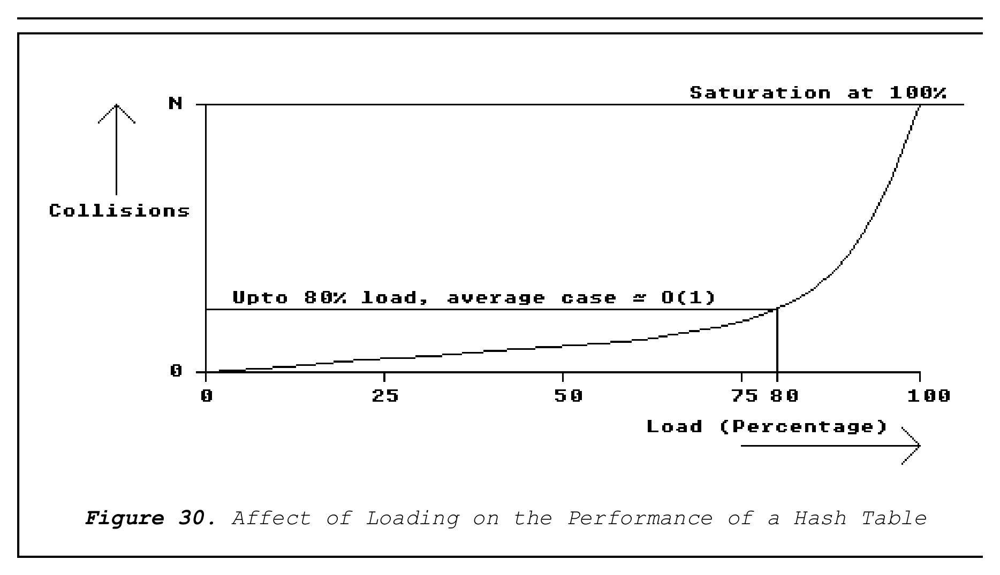

# Chapter 5. A Sample Implementation

This section of the report details the design and implementation of a sample meta-assembler system.

## 5.1. Problem Definition

The problem which, as defined at the start of the project, was 'to develop a meta-assembler with the following properties:

- Portable.
- Easy to use.
- Non-restrictive.
- General.'

For a more detailed description of these properties refer to section 4.2.

## 5.2. System Analysis

The purpose of the system analysis phase is to describe what is to be achieved and put forward suggestions of how this can be achieved. By doing background research into the problem, which was the concern of section 4, 1. The problem is well defined. 2. A number of alternatives for solving the problem have been suggested (and in most cases, implemented).

```
                                                                       SOURCE
                                                                       ASSEMBLY
                                                                       PROGRAM
                                                                                 LISTING & ERRORS
                 CROSS-ASSEMBLER                                XMETA
                    SEMANTICS
           Figure 19. XMETA system                                     OBJECT
           assembly process.                                           PROGRAM
```

There would be little point in repeating the information in section 4. The main task for the system analysis phase of the software cycle in this case, therefore, is to select an appropriate method of solving the problem, justifying that decision.

### 5.2.1. Approach to Solution

One of the major decisions which must be taken when selecting a method of solving the meta-assembler problem is what form the assembler description/specification should take. There have been two possibilities suggested:

1. Tables. The assembler description takes the form of one or more tables.
2. Languages. The assembler description takes the form of a program in a language which may be either macro- based or high level language-based.

When looking at these two choices conceptually they can be summarised independently of the physical form used to represent them.

1. Data-driven.
2. Algorithm-driven.

Both of these possibilities have their advantages and disadvantages. The data-driven approach is simpler and quicker to implement but is not very flexible while the algorithmic approach is very flexible but more complicated to implement. There is, however, a third choice which combines the benefits of both approaches while largely eliminating their weaknesses. This approach is 3. Data and Algorithm-Driven.

It might at first appear that XMETA (see section 4.8.5) falls into this category, but it is strictly algorithm-driven because variables of any kind are not allowed in the assembler description program (as with most language-driven implementations, only parameters are allowed). The most recent implementation of a meta-assembler32 does take this approach and the benefits are apparent in the flexibility which is provided (see section 4.8.7.). The way in which this particular implementation approaches the problem, however, means that only certain sections of the solution can be truly classed as data and algorithm-driven.

It is therefore proposed that the sample implementation should take a data and algorithm-driven approach.

The simplest solution to the problem using this approach was suggested by the authors of the XMETA system in their report 'A High-Level Language Based System for Cross-Assembler Definition'23.

Every dedicated assembler which is written is data and algorithm-driven. This has always traditionally been the best method of writing an assembler for one processor. The problem when considering how to reconfigure a dedicated assembler so that it can assemble another source language is that the assembler-specific part is spread throughout the whole of the source program. This is usually the case because it allows for the fastest implementation. The solution to this problem, therefore, is to separate out the assembler-specific and general parts of a dedicated assembler and make them as independent as possible. It will be seen that there is a trade-off between making some sections assembler dependent (which will mean new assembler descriptions are easier to implement) and the generality of the resulting meta-assembler.

```
      [label:] command [[prefix] argument [(index [,index])]
      [postfix][,...]] [;comment]
      Ident(0) Narg             Pref1(i)       Arg(i)         Xf1(i)      Xf2(i)         Post(i)
```

```
               Figure 20. XMETA Predefined Functions and Procedures.
```

Once the outline design had been chosen, the choice of which language to program the implementation in had to be made.

### 5.2.2. Selection of Programming Language

A number of factors affected the decision of which programming language to use when writing the sample implementation. These were (in order of priority):

1. A language which was either familiar or easy to learn.
2. Available on a large range of computers (microcomputer development systems upwards) and be portable in nature.
3. Suitable for programming a large software project. Provision for decomposing a problem into separate, manageable pieces.

```
     ALFA:       MOV          @BETA+1(R3),R2+
     Ident(0) = 1; Symbol(0) = 'ALFA';
     Narg = 2; Nforw(1) = . . . (depends on the context);
     Pref1(1) = ord('@'); Ident(1) = 1;
     Arg(1) = 1; Type(1) = forward;
     Symbol(1) = 'BETA'; Xf1(1) = 3 (supposing Ri = i);
     Pref2(1) = Pref3(1) = Xf2(1) = Post(1) = nul;
     Ident(2) = 1; Arg(2) = 2; Type(2) = Absolute;
     Symbol(2) = 'R2'; Post(2) = ord('+');
     Pref1(2) = Pref2(2) = Pref3(2) = Xf1(2) = Xf2(2) = Nforw(2) = nul;
     Symbol(i) = '        ' for i > Narg;
     any other function with argument > Narg = nul.
```

Figure 21. Examples of predefined function evaluations (assuming BETA has not yet been defined).

4. Support in some way for the principles of Object Oriented Software Construction.
5. Facilities for low-level, machine-oriented manipulations.
6. Fast enough to produce a usable product.
7. Good development environment with extensive debugging facilities.
8. Be available on the computer which is to be used for the implementation.

```
                                              Cross-assembler
                                              source (XMETA)
```

```
                     XMETA
                            XCOMP
                                                    System
                                                      Copy                              Cross-
                                                                                       assembler
                                                                                        listing
                          Intermediate                                 Procedure
                              code                                       table
                                                      XASM
                                  Load                            Load
                                  Code                         procedures
                                                      Loop
      Source
     assembler                                      Analyse                            Program
      program                                                                          listing
                                                  Interpret
                                                Print tables
                         Undefined                  Symbol                    Object
                          forward                   table                      code
                           table
                   Figure 22. Flow of control in the XMETA system.
```

The languages which were considered against this criteria were:

1. C.
2. C++.
3. Smalltalk V.
4. Modula-2.
5. Pascal.

All of these languages are available for the IBM XT computer which was to be used. The language which was chosen was Modula-2 because it is the best at meeting all the requirements specified. C was ruled out because it does not have very good facilities for large program structuring, has no Object Oriented Programming (OOP) facilities and was not very familiar. C++ (an OOP extension of C) was ruled out because it is even more difficult to learn than C. Smalltalk V, although having an excellent development environment and providing good support for OOP, does not produce code which is practical (in terms of speed and size) for this sort of application. Pascal was ruled out because it provides no facilities for OOP or large program structuring. Modula-2 gave the following answers to the selection criteria:

1. Modula-2 was a familiar language as it was the programming language chosen for the 'Programming and Programming Design' course in year 2 and for the 'Computer Systems' course in year 3.
2. Modula-2 development systems are available for virtually all well known computers, and it is small enough to be used on microcomputer development systems.

Interpreter Analyser Procedure name Procedures Syntax analyser table Syntactic Intr. Information Function on the Procedures current line intermediate code Semantic Intr. Global Function information symbol table Data area: stack Define defloc Semantic analyser Figure 23. Information flow within XASM 3. Very good facilities are provided for decomposing large programs in manageable chunks via the 'MODULE' structure. 4. Although support for OOP in Modula-2 is limited, an OOP approach to the design process maps well onto implementations. 5. Good low-level facilities are provided via the bitset type and associated set operations. 6. Recent benchmarks place Modula-2 compilers at the top in terms of generated code efficiency. 7. The implementation of Modula-2 chosen, JPI Topspeed Modula-2, has an excellent integrated environment with extensive debugging facilities. 8. JPI Topspeed Modula-2 is available for the complete range of IBM-compatible computers.

## 5.3. System Design

This phase of the software life cycle is concerned with the overall structure of the product and how, generally, it will solve the problem definition.

### 5.3.1. Decomposition into Modules

A useful decomposition of a traditional two-pass assembler into a number of modules is given by Gorsline in his book 'Assembly and Assemblers'1. The module titles are:

1. Input/output module.
2. Decoder from free-format module (lexical scanner).
3. Table entry/search module.
4. Location counter adjustment module.
5. Error handler module.
6. Assembler directive processor module.
7. Machine-code generator module.
8. Expression evaluation module.
9. Listing module.
10. Coordination (executive) module.

The next task is to decide which of these modules can be assembler-independent. Trade-offs between generality and ease-of-use/ease-of-implementation will have to be made.

It can be seen that the following modules can be assembler-independent without any trade-offs being made:

Input/output module. Table entry/search module. Location counter adjustment module. Listing module. Error handler module. Coordination module.

For the other modules, selection of whether the modules should be assembler dependent or independent will affect the performance of the meta-assembler.

Decoder from free-format module (lexical scanner).

```
                         Assembler
                        Descriptions
                                                                Assembly Source
                        Preprocessor
                                                                    Program
                  Logfile            Database                       Assembler
                    Figure 24. Structure
                                                              Object             Listing
                          of MAUFI
                                                               file               file
```

If this module is made assembler-independent the syntax of the assembly language statements for any assembly language must be fixed. This would mean that the meta-assembler could not mimic any dedicated assemblers and existing software would need converting from the dedicated assembler's syntax to the meta-assembler's syntax. The alternative is to supply the syntax of the assembly language in the assembler description. This has been done32 but requires larger assembler descriptions and a more complicated meta-assembler.

It was decided that this module should be assembler-independent because for the situations where a meta- assembler is most useful the fact that all assembly languages must have the same source syntax is actually an advantage. The need to mimic dedicated assemblers is not critical in these situations.

Assembler directive processor module.

If this module is made independent of the assembly language then the set of directives which are implemented are fixed, whatever assembly language is being assembled. If this module is supplied as part of the assembler description then assembler directives can mimic those of dedicated assemblers.

```
                          Section: Code Arrangement                              name
                          Alignment (odd/even)                              : xxx
                          Word length                                       : xx
                          Bit arrangement (0/15 LSB)                        : xx
                          Byte arrangement (n,n+1/n+1,n)
                                           ( 1 / 2 )                        : x
                          Data arrangement (High/Low)
                                           (byte first)                     : x
                          Any modifications (y/n) ?
                          MESSAGE:
```

```
                               Figure 25. Code Arrangement Form.
```

For the same reasons given for the lexical scanner, it was decided that this module should be assembler- independent. In that way, assembler directives are constant throughout the range of assemblers implemented.

Machine-code generator module.

This module really performs two tasks: Generation of the machine-code corresponding to an assembly language statement and writing the generated machine-code into an object code file.

The first task is definitely assembler dependent, but there is a choice with the second. If this task is made assembler dependent any format of object code can be produced. If this task is made assembler-independent, the format of the object code produced is fixed.

It was decided that a compromise between the two alternatives would provide the best solution, by making the object code generator assembler-independent but providing it with a number of alternative object code formats. This means that if there isn't an object code format provided which is suitable, either one can be added to the assembler-independent part of the meta-assembler (not necessarily the best solution) or a small conversion program could be written which converts a generic format of object code into the one required.

This module is therefore split into two separate modules:

1. Assembler definition module (ADM). This contains the target processors parameters and the machine code generator.

2. Object code generator module. This contains conversion routines which convert the standard machine code generated by the ADM into an object code format.

To summarise then, the set of main modules which make up the sample implementation are:

1. ADM - Assembler definition module.
2. Exceptions - Error handler module.
3. Expression - Expression evaluator module.
4. Interface - Input/output module.
5. Lex - Free format decoder module.
6. Listing - Listing file generator module.
7. ObjectGenerator - Object code file generator module.
8. PseudoOps - Assembler directive processor module.
9. Table - Table entry/search module.
10. M2Assem - Coordination (executive) module.

### 5.3.2. A General Model for Assembly Languages

As the decision had been taken that the lexical scanner module should be assembler-independent, a general model for assembly languages had to be developed as a specification of the syntax of any source language which could assembler assembly lang. assembler specification1 source file specification2 YACC lexical LEX (UNIX tool) analyser (UNIX tool)

```
                                                  parser
             error                                                                 sym table
           handling                                                                    &
            module                                                                 inst. set
                                                directive
                                                handling
                                                    &
                                               instruction
                                                 coding
                                                 module
           UNIVERSAL
        CROSS ASSEMBLER
                                listing                              binary
                                 file                                 file
```

1 - syntax rules 2 - lexical rules Figure 26. Structure of UCA.

be input. Rather than develop a model for all assembly languages, five were chosen to start with, so that the model was not initially over-complicated. The five processors were MC68000, 6800, 6502, Z80 and 80x86. The manufacturer's assembly languages were selected in each case.

It was found by examination that all of the assembly languages had the same general format for an assembly language statement:

[label] opcode operand(s) [comment] Similarly, assembler directives also conformed to a general format:

```
                    assembler              no of source             time            speed
                  (for which uP)              lines                 (sec)        (lines/sec)
```

```
                  Dedicated assemblers (from CROSS-8 package)
```

```
                  6805            271                               25           10.84
                  8051            308                               25           12.32
                  6804            100                               13           7.69
                  6800            350                               30           11.67
                  8085            880                               70           12.57
                  Z80             870                               67           12.98
                  Microsoft
                  MASM            130                                 7          18.57
                  2500 A.D.
                  68000 Assembler 200                               15           13.33
                  Universal Cross Assembler (from CROSS-8 package)
```

```
                  6502                     120                      32           3.75
                  6805                     100                      25           4.00
                  8085                     48                       13           3.69
                  8048                     80                       37           2.16
                  Z80                      250                      75           3.33
                  6801                     216                      40           5.4
                  8051                     120                      40           3.0
                  Chiu & Fu Implemented Assemblers
                  8086/88 COMASM           130                      50           2.60
                  68000 X68000             200                      73           2.74
                              Figure 27. Assembly speed statistics.
```

[label] directive argument(s) [comment] The differences in the syntax of the languages came when examining the individual fields of a statement.

Label Field.

The label field of all the assembly languages has to start in the first column of a source program and consists of an alphabetic character with alphanumeric characters following it. The number of significant characters varies between assembler implementations and is processor independent.

Opcode Field.

All opcodes consist of an alphabetic mnemonic which is always less than 5 characters in length. The Motorola MC68000 assembly language opcode is followed by a modifier which indicates the size of the operation:

.B = 1 byte. .W = 2 bytes/1 word. .L = 4 bytes/1 longword.

Amongst the processors chosen, any operation without a modifier defaults to a word size operation. This format is unique to the MC68000.

Operand(s) Field.

The operand(s) field of all the assembly languages all contain both an indication of the addressing mode being used and the values to be operated on. These values can take a number of forms:

Expressions - any set of constants can have either arithmetic or logical operations performed on them within the operand of an instruction.

Constants - represent the value of either a fixed value/attribute or a location in the source program. Examples are: - Registers. - Program counters. - Condition codes. - Stack base pointers. - Operand sizes. - Specific memory/IO locations.

Addressing Specifiers - expressions and constants are contained within addressing specifiers. These are formed using special ASCII characters.

Examples of Addressing Modes for Operands.

MC68000 - #constant Dn An (An) (An)+ -(An) constant(An) (constant,An) constant(An,index,constant.specifier) where n is a number from 0 to 7.

6502 - #constant constant (constant,X) (constant),Y Z80 - (register) constant (register+constant) (constant)

6800 - #constant constant X (constant)

80x86 - register constant [constant] [register] specifier[constant] Addressing mode modifiers are used within two of the assembly languages (68000 and 80x86) to specify or clarify the size of a particular operand. For each of these languages, defaults are assumed if these are omitted.

Addressing Modes.

The syntax of addressing modes can be seen to vary widely between assembly languages. The provision for all these formats of addressing modes would certainly lead to a complicated lexical scanner. The alternative to this is to formulate a set of standardised addressing modes with which all the assembly languages can be mapped onto. This produces an easier implementation and more elegant solution but would mean that some conversion of manufacturer's assembly languages to the standardised assembly language would be needed.

By initially basing a standardised set of addressing modes on the MC68000 syntax, it was possible to draw up syntax diagrams of a general assembly language model (for these five processors). A summary of the syntax diagrams is shown in Backus-Naur form in figure 28.

### 5.3.3. The IEEE Assembly Language Standard

The work carried out in section 5.3.3. was done prior to receiving a report by W. Fisher entitled 'Microprocessor Assembly Language Draft Standard'25. In this report, a standardised model of assembly languages is created by following a number of guidelines. Using this method, it is possible to implement an assembly language for virtually any processor using a completely standardised syntax. This was obviously more desirable than the limited syntax which was developed in the previous section. It was therefore decided that the sample implementation to be developed should have a lexical scanner which would accept any assembly language program conforming to this IEEE standard. This means that the implementation will not be able to accept source programs written using a manufacturer's assembly language syntax without some modification (quite extensive in some cases). This limitation is not severe, however, when the use of meta-assemblers is put into context. Section 4.7.2. pointed out that there were two main areas for which meta-assemblers are generally developed:

1. Educational establishments.
2. Small system developers.

For both of these areas, apart from the initial increase in activity due to converting existing software to the new syntax (which might be accomplished by a translation program automatically), the use of a generalised syntax is a productivity aid in that all programs developed have the same syntactic structure and the same set of directives (which are part of the defined standard). The operation of the meta-assembler will always be the same, so familiarity with it will increase instead of the decrease normally experienced when many dedicated assemblers are used within a short space of time.

Features of the Standard.

The IEEE Standard covers the following areas of assembly languages:

- Instruction Names.

- Mnemonics.
- Addressing Modes.
- Operand Sequences.
- Expression Evaluation.
- Constants.
- Labels.
- Comments.
- Assembler Directives.
- Standard Instruction Sets.

Instruction Names.

The standard defines a large set of standard instruction names which are to be used when the comparable instruction exists in an assembly language. If an instruction does not have a comparable standard name, one should be invented: instruction names shall begin with an action verb.

Instruction Mnemonics.

A set of rules is given for the mnemonics of instructions which are not contained within the standard. These are:

1. The first character of a mnemonic shall be the first letter of the action verb.
2. Addressing modes shall not be embedded in the mnemonic.
3. Operand designations shall not be embedded in the mnemonic.
4. Conditions shall be embedded in the mnemonic.
5. Operand type may be indicated, where appropriate, by the last character of a mnemonic, as shown below (the default operand type is word):

B: Byte. H: Halfword. L: Long (Double Word). D: Decimal. F: Floating Point. 1: Bit. 4: Nibble or Digit.

M: Multiple.

Also given is a complete set of modifier extensions used to indicate conditional instructions.

Addressing Modes.

A set of addressing modes is defined in the standard. Addressing modes are specified by adding special characters to the operands. The following prefix and postfix characters are used:

Mode Symbol Example Absolute prefix / /addr Base page prefix ! !addr Indirect prefix @ @addr Relative prefix $ $addr Immediate prefix # #value Index enclosing addr(index) parenthesis () Register prefix . .addr Auto-pre-increment prefix + +addr Auto-post-increment postfix + addr+ Auto-pre-decrement prefix - -addr Auto-post-decrement postfix - addr- Indirect-pre-indexed prefix () @ addr(index)@ Indirect-post-indexed prefix @, @addr(index) postfix ()

Operand Sequences.

The proper sequence of operands in any particular instruction is given in the standard.

Move operands. The source of data is defined to be the primary operand. The operand sequence shall be: source, destination.

Load and Store operands. The register to be loaded or stored is defined as the primary operand. The operand sequence shall be: register, memory.

Arithmetic operands. In two operand instructions, the operand that is both the source and destination is the primary operand, and the second source is the secondary operand. In three operand instructions, the result is defined to be the primary; therefore the destination shall be the first operand, followed by the "first" source, then the "second" source.

Expression Evaluation.

When expression evaluation capabilities are included in an assembler, the expression operators shall be designated by the following special infix symbols:

```
          Symbol              Operation
          +                   Add
          -                   Subtract
          *                   Multiply
          /                   Divide (Signed)
          //                  Divide (Unsigned)
          .AND.               Logical AND
          .OR.                Logical OR
          .XOR.               Logical Exclusive OR
          .NOT.               Logical NOT
          .SHL.               Left Shift
          .SHR.               Right Shift
          .MOD.               Modulo
          **                  Exponentiate
          <:>                 Bit alignment
```

Constants.

All numeric constants shall be represented by an alphabetic character specifying the base followed by an apostrophe. The following characters are reserved for the specified base:

Character Base Example B Binary B'1001111 Q Octal Q'117 D Decimal D'79 H Hexadecimal H'4F A default is assumed if no specifier is given. This can be changed using the BASE assembler directive.

Character strings shall be enclosed within quotation marks:

"THIS IS A CHARACTER STRING"

The special symbol * shall be used to refer to the location counter.

Labels.

All labels shall begin with an alphabetic character in the first column on a line. At least one blank must separate the label from the rest of the line. Labels may optionally be terminated with a colon.

Comments.

Comments may appear after a statement on the same line, or on a separate line. Each comment shall start with a semi-colon. For example, ; This is a comment BZ NEXT ; Comment on same line Assembler Directives.

The naming of assembler directives shall follow the rules given for instructions. If the following functions are implemented, the specified mnemonic shall be used.

```modula-2
             Mnemonic                Function
             ORG                     Set location counter to expression
             EQU                     Equate label to expression
             END                     Mark end of source program
             PAGE                    Advance page in listing file
             TITLE                   Set title in listing file
             DATA                    Fill memory with specified data
             RES                     Reserve memory of specified size
             BASE                    Change default expression base
```

Standard Instruction Sets.

Standard instruction mnemonic sets are provided for the following processors:

Intel 8086 Motorola 6800 Zilog Z80, Intel 8080 and 8085 DEC LSI-11 Motorola MC68000 Zilog Z8000

## 5.4. Detailed Design

The approach taken towards the detailed design of modules was to design them with the principles of Object Oriented Programming in mind. This particular design philosophy was chosen because it is the way in which software engineering as a whole is turning because the principles behind it lead to the generation of 'better' software. By 'better' it is meant that software is more robust and reliable. The method used to achieve this is by breaking a system down into a number of objects which are independent of their environment. The objects encapsulate data structures and procedures which operate on them.

Frank and Hewitt's book entitled 'Software Engineering in Modula-2' quotes a number of claims which are typically made for Object Oriented Systems:

- Increased comprehensibility.
- Guaranteed data integrity.
- Enable implementations to be easily changed.
- Provide data independence.
- Encourage independent development (of objects and collections of objects).
- Reusability and extendability.

It can be seen that this design philosophy is very suitable for the development of meta-assemblers which, in themselves, have to be very adaptable. It is the very fact that traditional dedicated assemblers are written by decomposition into functional modules rather than objects that leads to them being so unadaptable to other assembly languages.

Support for OOP in Modula-2 is limited. However, by combining object oriented design (which can be done independently of the programming language to be used) and Modula-2 features which support OOP, a robust and reliable implementation can still be produced.

### 5.4.1. Modula-2 Support for Object Oriented Programming

This section describes the limited support that Modula-2 provides for OOP and defines some of the OOP features supported. Material was taken from 'Software Engineering in Modula-2'12 and 'Data Structures with Modula-2'11.

Object.

In Modula-2, each object can be implemented as a MODULE containing a data structure and a number of operations (procedures and functions) which can be performed on that structure. If the object represents a single entity then it is an Abstract State Machine and if the object represents a class of entities then it is an Abstract Data Type.

Data Structure.

There are two types of structure which can exist in an object. A transparent data structure is one which is completely accessible to a user of that object and can be manipulated outside the object. An opaque data structure is one which cannot be manipulated outside an object and is therefore more secure. Opaque data structures do have some disadvantages, however.

Operations.

Operations which can be performed on a data structure can be put into a number of classes.

1. Constructors. A constructor operation for a given object is one which creates an instance of that object from its component parts.
2. Selectors. A selector operation for a given object is one which selects a specific component part of an instance of that object.
3. Exceptions. Erroneous conditions which arise out of the use/misuse of an object can be handled in one of two main ways:

A predicate is provided which, when called, returns information about the state of an object.

An exported variable is provided which can be tested by a client program to provide information about the state of an object.

There is one other method of providing a satisfactory solution to exceptions, which is to provide exceptions themselves as an object.

Another important concept of OOP is module reusability. Depending on the type of software being developed, this may or may not influence the design of objects. In an assembler, most of the modules are very specific to this type of problem and are unlikely to be usable in many other programs. For these objects, designing for reusability is not important. The exceptions to this are the user interface object (input/output module) and the table object (table entry/search module). Objects of this type appear in many programs and it is worth designing them to be reusable. This involves trying to generalise their operation as much as possible and providing operations which will cover every eventuality as to how the object will be used. In practice, this leads to longer development times and objects which have more operations.

### 5.4.2. Detailed Design of Modules

The following sections describe the design of the individual modules which make up the meta-assembler. The modules were designed, implemented and tested in the following order:

1. Strings. | 2. Table. |- These four modules were reused from previous 3. TableTrees. | programming projects. 4. TableExt. | 5. Exceptions. 6. Lex. 7. Expression. 8. Interface 9. Listing. 10. Object Generator. 11. ADM. 12. M2Assem. 13. PseudoOps.

Three test programs were also developed in order to test these modules. The listings for the above modules and the test modules can be found in the appendix.

### 5.4.3. Character String Handling Module (Strings)

This module was reused from a previously implemented version. The module implements the standard operations associated with character strings. An abstract data type, String, is defined with associated operations. The decision to implement the abstract data type transparently (rather than opaquely) was made because there was a large need to be able to define constants within other modules. This cannot be done with opaquely exported types (which is one of their drawbacks).

### 5.4.4. Exception Handler Module (Exceptions)

This module handles all the exceptional conditions which can occur within the operation of the meta-assembler. The module implements an object whose data structure is an abstract state machine. This approach is used because Syntax: = equivalent | one or the other (OR) [] zero or one times {} zero or more times "" literal symbol .. OR between sequence of characters Statement = [Label] Seperator Command [Specifier] Seperator [Operand {"," Operand}] [Seperator Comment] EOL Seperator = {"<TAB>"} | {"<SPACE>"} Label = Alphabetic {Alphanumeric} [":"] Alphabetic = "A".."Z"|"a".."z" Alphanumeric = Alphabetic | Numeric | Special Numeric = "0".."9" Special = "_" (dependent on implementation) Command = Alphabetic {Alphabetic} Specifier = ["." Alphabetic] Operand = {Value | "(" Value ")" "+" | "-" "(" Value ")" | "[" Value "]" | "#" Value} Value = Alphanumeric [Alphanumeric] [Specifier] | Expression Expression = dependent on implementation (includes logical and arithmetic ops)

```
                   Figure 28. A Generalised Model of Assembly Languages.
```

only one exception can be raised at any time. There are three possible levels of exception which can be raised:

Warning. Exceptions at this level cause no change in the operation of other modules. A message is produced in the listing file at the current line and at the console.

Error. Exceptions generated at this level cause output to the object code file to be terminated. An appropriate message is written to the listing file and console.

Fatal. An exception at this level causes the complete shutdown of the meta-assembler. This includes the closing of all files and the deallocation of all memory currently in use. The shutdown is effected by calling operations in every module which execute a shutdown procedure specifically for that module.

There are four possible types of exception:

Code. A code exception is generated as the result of an error occurring in the source program.

User. A user exception is generated as the result of a bad command line (for example, specifying a non-existent source file).

Environment. Exceptions of this type are generated when references to the environment of the meta-assembler are erroneous. For example, a memory allocation or IO operation fails.

Internal. Exceptions of this type are reserved for internal errors in the meta-assembler and do not occur in normal use.

As a result of the raising of these exceptions, the meta-assembler can be in one of four states:

Normal. This is the state in which the meta-assembler starts.

NoCode. The meta-assembler does not produce an object code file in this state.

NoList. In this state, no listing file is produced.

NoOutput. In this state, neither listing or object code file is produced.

Operations provided in the exceptions object are:

Raise - enables a module to raise an exception of a particular type and level and provide a suitable message. ChangeStatus - The status of the program can be explicitly changed. ProgramStatus - The current status of the meta-assembler is returned. Number - The number of exceptions raised since the start of assembly is returned.

### 5.4.5. Lexical Scanner Module (Lex)

The purpose of the lexical scanner module is to decode a free-format assembly language into a fixed-format instruction (more details of this stage of assembly in section 4.6.1.). The format of the assembly language statement is given in the IEEE Standard which can be summarised:

[label[:]] command[.modifier] [[prefix]argument[(index[,index])][postfix][,..])] [;comment] where [] indicates optional fields and a space indicates whitespace.

The output of the lexical scanner is in the form of a data structure, which is defined in the assembler definition module.

Two operations are provided within this module:

ScanLine. This is the operation which performs the lexical scan. The string of characters supplied to this operation is examined one character at a time from the left hand column. Fields of the source line are identified and extracted as each character is read. Fields are identified by the comparison with termination and continuation characters. Continuation characters are those allowed in a field and termination characters mark the end of a field. The following list gives the appropriate termination and continuation characters for each field.

Field Termination Continuation Label Colon, Whitespace Alphanumeric Command Whitespace, Fullstop Alphabetic Modifier Whitespace - Prefix - PrefixSet Argument Whitespace, Open bracket - Index Comma, Close bracket - Postfix - PostfixSet Comment End of line - where PrefixSet = '/', '!', '@', '$', '#', '+' or '-'. PostfixSet = '+' or '-'.

The operation only separates fields so, for example, it cannot check to see whether an expression is valid. Errors in the assembly language statement which can be detected are:

Label Error - The label field starts with a non-alphabetic character. Modifier Error - The modifier character is not one of those allowed. Command Error - The command field contains a non-alphabetic character. Comment Error - A comment does not start with a semi-colon. Operand Error - A complete operand is badly formed. Index Error - An operand index is badly formed. EOL Error - A valid statement was not read before the end of line was reached. Too many operands error - The maximum number of complete operands allowed is exceeded. The maximum is assembler-dependent and is therefore defined in the ADM.

Too many indices error - The maximum number of indices allowed is exceeded. The maximum is assembler- dependent and is therefore defined in the ADM.

Another operation called ScanOperand is provided by this module. It takes as input an operand field of the decoded line and returns the IEEE addressing mode to which the operand conforms (or raises an exception).

### 5.4.6. Expression Evaluator Module (Expression)

The purpose of the expression evaluator module is to evaluate expressions which conform to the IEEE syntax. Expressions have the general form:

[expression operand 1] operator expression operand 2 The expression operands can be either symbolic names or constants. The evaluator therefore needs access to the table so that the value of symbolic names can be determined. The operation Evaluate performs this task.

The Evaluate operation first determines whether there is an operand in front of the operator by checking whether the first character in the input string is a '.'. If there is an operand, it is read and checked against entries in the table. If an entry is not found, the operand is checked to see whether it is a valid constant. An exception is raised if it is not. The operator is then read and checked and then the second operand is read. An operation is then called which applies the appropriate operation on the two operands. The only operation which has one operand is the .NOT. operation. If the expression is valid a LONGINT value is returned, otherwise an exception is raised (this includes operand type errors and results which are out of range). The type of the value returned depends on the types of the values of the operands and errors may be produced if an operation is attempted on two operand with incompatible types. The table below shows the operations available and the operand types which are valid.

Operation to perform A op A A op R R op A R op R SHL,SHR A # # # AND,OR,XOR,NOT A # # # * A # # # /,// A # # # + A R R # - A # R A Where:

'A' indicates an ABSOLUTE operand. 'R' indicates a RELATIVE operand. '#' indicates an invalid expression.

Other operations:

CheckRegister. This operation takes a string of characters and checks to see whether the string represents a valid register. The set of valid registers is defined in the ADM.

CurrentBase. This operation is a predicate which returns the current default base.

ChangeBase. This operation changes the current default base.

### 5.4.7. Input/Output Interface Module (Interface)

This module provides the only connection through which the meta-assembler can communicate with its environment. Restricting all the input and output operations to one module increases the program's portability, as only one module will need changing in the event of a transfer to a computer with a different standard IO library.

Three objects are defined in this module: File, CommandLine and Time.

The File object exports transparently the data structure FileHandle. An opaque export could not be used because it was necessary for client modules to assign constant values to the data structure. Operations which can be performed on a FileHandle are:

FileExists - Test whether a file exisits. CreateAFile - Create a new file. OpenAFile - Open an existing file. CloseAFile - Close an existing file. DeleteAFile - Delete a file. EndOfFile - Test if the end of file has been reached. ReadAString - Read a string of characters from a file. WriteAString - Write a string of characters to a file. ReadAChar - Read a single character from a file. WriteAChar - Write a single character to a file. NextPrinting - Read the next character that is printable.

WriteALine - Writes a newline character to a file. ReadACard - Reads a cardinal value in decimal form from a file. WriteACard - Writes a cardinal value in decimal form to a file. ReadALongInt - Reads a long integer in decimal form from a file. WriteALongInt - Writes a long integer in decimal form to a file. ReadALongHex - Reads a long integer in hexadecimal form from a file. WriteALongHex - Writes a long integer in hexadecimal form to a file.

All read and write operations are buffered to improve IO performance.

Five predefined file handles exists for special input and output. These are:

StdIn - Standard input, normally keyboard. StdOut - Standard output, normally VDU. ErrOut - Error output, normally VDU. AuxDev - Auxiliary device, normally serial port. PrtDev - Printer device, normally parallel port.

The CommandLine object has an abstract state machine data structure and only has two associated operations (which are both selectors):

ReadArgument - Given the number of an argument on the command line it returns that argument. An argument is defined as a character string surrounded by whitespace. NumberOfArguments - Returns the number of arguments on the command line.

The creator operation of this object is within the Modula-2 run-time system and is called when the program is run.

The Time object is very similar to the CommandLine object in that only selector operations are available within the Interface module. These are:

GetTime - Returns the current hours, minutes and seconds. GetDate - Returns the current year, month and day.

The creator operation for this object is also within the Modula-2 run-time system and is presumably called at least once a second.

### 5.4.8. Listing File Control Module (Listing)

This module creates the listing file which is output from the meta-assembler. The listing file is implemented as an abstract state machine. It has two basic structures:

Page - The layout of a listing page is controlled by two operations: SetPageLength and SetLineLength. The first line of any listing page contains the page number, date and time. The second line contains the listing title, which is set by the SetTitle operation (the default is no title). The third and fourth lines of any listing page are always blank.

Line - Any line in the listing (apart from the first four on a page) contains four fields:

1. Line number, relative to the start of the listing file.
2. Address of the machine code instruction on that line (in hexadecimal format). Possible addresses range from 0 to 4GBytes.
3. Machine code. The machine code of the instruction on the line is given in hexadecimal form. The operation to write the machine code to the listing file is assembler-independent in that it adjusts itself to compensate for different word lengths and the maximum length of instructions.
4. The original assembly language statement follows the machine code field.

At the end of the listing file, assembly statistics are given for assembly time and assembly rate. Depending on the state of an internal switch (modified by the SymbolTable operation) a symbol table dump may/may not be included. The main part of the symbol table dump is performed by two operations exported from the table module (see section 4.8.10.). Similar switches control the inclusion of addresses and machine code.

When errors occur they are added to the listing file on separate lines to assembly language instructions and always follow the instruction to which they refer.

Other operations allow for the advancement of a page or line, and predicates allow tests for the following:

Whether a listing file is currently open. The current source line being assembled in the source program. The current line being written to the listing file. The page and line length and the assembly rate in lines/minute.

### 5.4.9. Object Code Generator Module (ObjectGenerator)

This module is very similar to the listing module in design and functionality. Its purpose is to create the object file output by the meta-assembler. The format of this file is set with the SetFormat operation. Machine code instructions are added to the file with the AddCode instruction. Whether the object file is created or not is determined by the ObjectOutput operation.

### 5.4.10. Table Handler Module (Table, TableTrees, TableExt)

function f:

```
                  l     =        f(k)
```

The performance of the implementation is determined by the choice of function f and the method of handling collisions.

Hashing Function.

A good hashing function will produce a uniform distribution of locations in a hash table given a random set of keys. There have been many suggestions for the implementation of the hashing function. The purpose of the hashing function in the case of the meta-assembler is to take an alphabetic key (either the mnemonic name or symbol name) and return an address within the array at which the data on the key will be stored. One of the simplest and most effective hashing algorithm is the division hashing algorithm. Characters in the key are multiplied by their positions in the string and added together. The total is then taken modulo the table size to give the position in the table.

h(K) = K MOD M where K is the key to be hashed, h(K) is the hashed key, M is the size of the table.

Hashing Collisions.

The main drawback to hash tables is that collisions occur where two or more keys 'hash' to the same location in the table. Figure 30 shows how the performance of a hash table is drastically reduced when it becomes more than 80% full. There have been a number of proposals to the solution of this problem, some of which are:

- Linear Probing. When a collision occurs, one of the colliding data elements



*Figure 30. Affect of Loading on the Performance of a Hash Table*

is put in the next available location in the table.

- Nonlinear Probing. A secondary hashing function is applied to any key which collides when hashed by the primary function.

- Bucket Hashing. Each location in the hash table can contain many data items. The data structure which provides this 'bucket' can be:

```
      - Linked          list.
      -     Binary       search    tree.
      -     Another       hash     table.
```

```
                                Operation
                                On Table                Best Case                 Worst Case
                                Insert                    O(1)                      O(1)
                                Retrieve                  O(1)                    O(Log(N))
                                Delete                    O(1)                      O(N)
                                Report                    O(N2)                     O(N3)
```

```
                     Figure 31. Performance of a Hash Table with Binary
                                   Search Tree 'Buckets'.
```

The method selected for the implementation is bucket hashing because it is less complicated than the other methods and can be dynamic which allows a hash table of any size (which stops the performance of the table from dropping drastically). In terms of overall performance, it is better to use a binary search tree when bucket hashing because they are quicker than linked lists (see figure 29) but are still dynamic (which hash tables are not).

Figure 31 gives the big O performance of the hashing table and binary search tree buckets combination. Performance on all functions is good except the 3 report function where performance drops to O(N ). This, is still acceptable, however, as the operation is only used when symbol tables are being dumped (i.e., at most once in an assembly run). The other possibility would be to report without alphabetical sorting of the key items which would reduce big O value.

The three modules which implement the hash table are:

Table. This module implements the hash table as an abstract state machine. Operations on the table use the BST (Binary Search Tree) object which is implemented by the TableTrees module. All operations in this module are completely data independent (except that the key must be a string of characters).

TableTrees. This module implements a BST abstract data type and associated operations. The BST is exported opaquely and is therefore totally secure.

TableExt. This module (Table Extensions) contains the data structure which defines the data to be stored in the table and the operations on this data structure which are data-dependent. As two complete sets of data are required (one for instruction mnemonics and assembler directives, and one for symbols) the data structure used is a variant record. These allow for the most efficient storage of data. The data to be stored is:

For mnemonics and assembler directives: * Name (Key). * Type (or class). * Machine code mask.

For symbols: * Name (Key). * Value. * Status (Absolute or Relative).

This module provides two operations, InsertCommand and InsertSymbol which allow for the convenient insertion of either commands or symbols into the table. The advantage of using these operations is that a data structure does not need to be constructed to use them. They construct the appropriate data structure and then use the data structure-independent operation Insert (in the Table module) to enter them into the table. Operations are also supplied to write and read the data structure from and to a file, although these are not used by the meta-assembler. The other two operations provided allow the conversion of a machine instruction mask from and to a readable format (again, these are not used).

### 5.4.11. Assembler Definition Module (ADM)

The purpose of the assembler definition module is to encompass all the assembler dependent data structures, parameters and algorithms. The two parts of the ADM, the definition and implementation modules, serve two purposes.

Definition Module.

This module describes the assembler to the rest of the modules via a number of parameters (Modula-2 constants). These are:

WORDLENGTH. The wordlength describes the length of a basic machine code instruction unit in terms of the number of bits required. Although the decision as to what constitutes a word in any processor is somewhat subjective, virtually all processors have an easily identifiable word length. Figure 32 gives a number of processors and their associated word length.

```
                                           Processor                     Wordlength
                                                                         (in bits)
                                           Intel 8088                        8
                                           Motorola 6800                     8
                                           Motorola 68000                    16
                                           Commodore 6510                    8
                                           Zilog Z80                         8
                           Figure 32. Wordlengths of Various Processors.
```

MAXINDICES. This constant describes the maximum number of indices allowable in an operand.

MAXOPERANDS. This constant describes the maximum number of operands allowable in an assembly language statement.

MAXWORDSPERINSTRUCTION. This constant describes the number of machine words in the longest machine instruction.

MEMLOW, MEMHIGH. These two constants describe the range which the processor can address. Depending on whether the assembler is specific to one computer, this can also describe the maximum memory physically possible on that computer.

NOOFREGISTERS. This constant is used to define an array which must be filled with the character string representations of all the registers that can be used in the assembly language being described. The array, ValidRegisters, is filled within the main body of the ADM implementation module.

Data structures to describe a machine word, instruction, all valid addressing modes, an operand element and a decoded line are included in the ADM definition module for convenience.

Implementation Module.

The ADM implementation module describes two operations which together form the algorithmic part of the specification for a processor.

InsertOpcodesInTable. This operation, as its name suggests, inserts all the assembler opcodes into the opcode/symbol table. This operation is called from the coordination (M2Assem) module. The operation uses the InsertCommand operation exported by the TableExt module to insert opcode manes into the table with their associated instruction mask and type. The type of the instruction is dependent on the layout of the instruction formed when using the opcode and is chosen by the programmer. It is used within the Assemble operation to select the appropriate algorithm to assembler the instruction.

Assemble. This operation forms the main part of the ADM implementation module and implements the code generator of a traditional dedicated assembler. The operation has an overall structure which is assembler-independent. This is shown in pseudo-code in figure 33. Each Type operation assembles a different format of machine instruction. As was shown in section 4.5., the regularity of a processors instruction set determines the number of instruction formats (and therefore Type operations) which are required. It follow that the length and complexity of the Assemble instruction depends to a great extent on the regularity of the instruction set of the processor being described.

The Assemble operation, and therefore each Type operation, is supplied with two parameters:

1. The data structure containing the decoded assembly language statement which is produced by the ScanLine operation in the lexical scanner module (Lex).
2. The current pass number (each Type operation used will be called twice, once for each pass).

The Assemble operation must produce two data items:

1. The machine code instruction corresponding to the decoded assembly language statement input.
2. The length of the above instruction.

```modula-2
                                       operation Assemble
                                            operation Type01
                                            operation Type02
                                            :
                                            :
                                            operation TypeN
                                       begin
                                         if PassOne then
                                           CheckForLabel
                                           if IsLabel then
                                              InsertLabelInTable
                                           end
                                         end
                                         if IsCommand then
                                           case CommandType of
                                              1: InstructionLength := Type01
                                              2: InstructionLength := Type02
                                              :
                                              :
                                              N: InstructionLength := TypeN
                                           else
                                              AssemblePseudoOp
                                           end
                                         else
                                           NoCommandError
                                         end
                                       end
                                 Figure 33. Internal Structure of Assemble
                                                 Operation.
```

The task which the Type operations must perform is dependent on which pass the meta-assembler is currently on.

In pass one the sole task is to determine the length of the machine code instruction. Depending on the processor being assembled for, this may simply involve returning the appropriate value (in which case pass one operation become trivial). However, with some processors the instruction is not constant and depends on the data length (modifier) and operands. In this case, more work is done which sometimes involves analysing operands.

In pass two, the Type operations perform the translation of decoded assembly language statement into machine language instruction. This process generally requires four steps (which may be in different orders or with some steps unnecessary).

1. The addressing mode of each of the operands in the assembly language statement must be determined (using the ScanOperand operation exported by the lexical scanner).
2. The number of operands and the correct addressing modes must be checked. If there is an error an exception must be raised with a suitable error message.
3. Each operand and index must be evaluated (using the Evaluate operation exported by the Expression module) or alternatively checked to see whether it is the appropriate register (using the CheckRegister operation, also exported from Expression). If an expression is not in the required range or a register is not of the correct type an exception should be raised.
4. Finally, the machine code instruction should be assembled. This may involve the conversion of operands into the appropriate format required.

Once the machine code instruction has been assembled, it can be returned together with its length. Control then passes back to the calling module (M2Assem in this case) for assembly to continue.

In order to test this design an ADM was developed for the Motorola MC68000 processor. A description of this design follows.

### 5.4.12. ADM for the Motorola MC68000

The first task required in producing an ADM for the MC68000 was to provide values for the processor parameters.

WORDLENGTH = 16 MAXINDICES = 2 MAXOPERANDS = 2 MAXWORDSPERINSTRUCTION = 5 MEMLOW = 0 MEMHIGH = 1000 X 1024 (1 MByte)

NOOFREGISTERS = 17 The next task, turning to the implementation module, was to define all the possible registers. This was done by making assignments to the ValidRegisters array in the module body.

ValidRegisters[1] := "D0"; : : ValidRegisters[8] := "D7"; ValidRegisters[9] := "A0"; : : ValidRegisters[16] := "A7"; ValidRegisters[17] := "SP"

The InsertOpcodesInTable operation then needed to be filled with the appropriate InsertCommand operations. The problem is that the IEEE defined opcode set does not match one for one the Motorola defined opcode set, meaning that one IEEE opcode can map onto several Motorola opcodes. The solution is to have a number of pseudo-Type operations which select the appropriate instruction format by examining the addressing modes of operands. Figure 34 shows all the IEEE standard mnemonics, the appropriate opcode mask, the type of the opcode and the corresponding Motorola opcode mnemonic(s). Note that the instruction types, as well as the standard 18, include an extra eight which correspond to IEEE standard opcodes which map onto several formats of instruction. The InsertCommand operations were then written from this table.

The other mapping which took place was from the IEEE standard addressing modes to the appropriate Motorola addressing modes. This can be seen in figure 35.

An operation, RegisterType, was is used to determine whether a register is a data or address register. Another operation allows the addition of a binary word at any position in another word. Many of the Motorola instruction formats include a field for a register and an effective address (see figure 6). Two IEEE Machine Code Mask STD MSB LSB Class Motorola Mnemonic 15 0 Mnemonic ADD 1101000000000000 19 ADD,ADDA,ADDQ,ADDI ADDD 1100000100000000 6 ABCD ADDC 1101000100000000 5 ADDX SUB 1001000000000000 19 SUB,SUBA,SUBQ,SUBI SUBD 1000000100000000 6 SBCD SUBC 1001000100000000 5 SUBX MULU 1100000011000000 3 MULU MUL 1100000111000000 3 MULS DIVU 1000000011000000 3 DIVU DIV 1000000111000000 3 DIVS CMP 1011000000000000 19 CMP,CMPA,CMPI,CMPM NEG 0100010000000000 13 NEG NEGC 0100000000000000 13 NEGX NEGD 0100100000000000 15 NBCD EXT 0100100000000000 17 EXT DBR 0101000011001000 12 DBRA,DBF DBE 0101011111001000 12 DBEQ DBNE 0101011011001000 12 DBNE DBC 0101010111001000 12 DBCS DBNC 0101010011001000 12 DBCC DBP 0101101011001000 12 DBPL DBN 0101101111001000 12 DBMI DBNV 0101100111001000 12 DBVS DBGT 0101111011001000 12 DBGT DBGE 0101110011001000 12 DBGE DBLT 0101110111001000 12 DBLT DBLE 0101111111001000 12 DBLE DBH 0101001011001000 12 DBHI DBNH 0101001111001000 12 DBLS AND 1100000000000000 19 AND,ANDI OR 1000000000000000 19 OR,ORI XOR 1011000000000000 19 EOR,EORI NOT 0100011000000000 13 NOT SHR 1110000000001000 21 LSR SHL 1110000100001000 21 LSL SHRA 1110000000000000 21 ASR SHLA 1110000100000000 21 ASL ROR 1110000000011000 21 ROR ROL 1110000100011000 21 ROL RORC 1110000000010000 21 ROXR ROLC 1110000100010000 21 ROXL TEST 0100101000000000 13 TST TEST1 0000000100000000 22 BTST TESTSET 0000000111000000 22 BSET TESTCLR 0000000110000000 22 BCLR TESTNOT 0000000101000000 22 BCHG Figure 34. IEEE Standard Opcodes with Motorola Equivalents (1 of 2).

CHK 0100000110000000 3 CHK LD 0000000000000000 23 LEA,MOVE,MOVEA, MOVEP,MOVEQ LDM 0100110010000000 14 MOVEM ST 0000000000000000 23 MOVE,MOVEP STM 0100100010000000 14 MOVEM MOV 0000000000000000 23 MOVE,MOVEM,MOVEP, MOVEA,MOVEQ XCH 1100000100000000 24 EXG,SWAP CLR 0100001000000000 13 CLR SET 0101000011000000 10 ST SETE 0101011111000000 10 SEQ SETNE 0101011011000000 10 SNE SETC 0101010111000000 10 SCS SETNC 0101010011000000 10 SCC SETP 0101101011000000 10 SPL SETN 0101101111000000 10 SMI SETV 0101100111000000 10 SVS SETNV 0101100011000000 10 SVC SETGT 0101111011000000 10 SGT SETGE 0101110011000000 10 SGE SETLT 0101110111000000 10 SLT SETLE 0101111111000000 10 SLE SETH 0101001011000000 10 SHI SETNH 0101001111000000 10 SLS BR 0110000000000000 25 BRA,JMP BE 0110011100000000 11 BEQ BNE 0110011000000000 11 BNE BC 0110010100000000 11 BCS BNC 0110010000000000 11 BCC BP 0110101000000000 11 BPL BV 0110100100000000 11 BVS BNV 0110100000000000 11 BVC BGT 0110111000000000 11 BGT BGE 0110110000000000 11 BGE BLT 0110110100000000 11 BLT BLE 0110111100000000 11 BLE BH 0110001000000000 11 BHI BNH 0110001100000000 11 BLS CALL 0110000100000000 25 BSR,JSR RET 0100111001110101 18 RTS RETR 0100111001110111 18 RTR RETE 0100111001110011 18 RTE NOP 0100111001110001 18 NOP PUSH 0100100001000000 26 LINK,PEA,MOVE POP 0100000111000000 26 UNLK,MOVE WAIT 0100111001110010 18 STOP BRK 0100111001000000 16 TRAP BRKV 0100111001110110 18 TRAPV RESET 0100111001110000 18 RESET Figure 34. IEEE Standard Opcodes with Motorola Equivalents (2 of 2).

Addressing Mode Equivalents:

Motorola Format IEEE Format Register Direct Direct Dn,An .Dn,.An Address Register Indirect Indirect (An) @.An Addr. Reg. Indirect with Post-increment Auto-post-increment (An)+ .An+ Addr. Reg. Indirect with Pre-decrement Auto-pre-decrement -(An) -.An Addr. Reg. Indirect with Displacement Indirect-post-indexed d16(An) or (d16,An) @.An(d16)

Addr. Reg. Indirect with Index Indirect-post-indexed d8(An,Xn.W) or (d8,An,Xn.W) @.An(d8,.Xn) d8(An,Xn.L) or (d8,An,Xn.L)

Absolute Long Address Absolute xxx.L /xxx Absolute Short Address Absolute xxx.W /xxx Program Counter with Displacement Indirect-post-indexed d16(PC) or (d16,PC) @*(d16)

Program Counter with Index Auto-post-index d8(PC,Xn.W) or (d8,PC,Xn.W) @*(d8,.Xn) d8(PC,Xn.L) or (d8,PC,Xn.L)

Immediate Data Immediate #xxx or #<data> #xxx or #<data> Figure 35. IEEE Addressing Modes and their Motorola Equivalents.

operations were therefore provided to add a register and an effective address at any point within a machine instruction word.

The MC68000 is one of the processors for which the calculation of the length of an instruction is not always determined by its opcode. Pass one of the assembler is therefore more complicated in some Type operations.

For those instructions whose length is not always one word, the length is determined by the effective address field. Depending on the addressing mode, an instruction can be from one to five words long. The CalcEA operation determines the length of these instruction on pass one and assembles the effective address field on pass two.

The checking for the correct addressing mode, number of operands and number of indices is done within each Type operation, where necessary. The command modifier is also checked to determine whether an assembly language statement is to operate on byte, word or longword quantities.

The pseudo-Type operations use the ScanOperand operation to determine the addressing modes of operands which in turn determines which Motorola instruction format to choose. Calls to other Type operations occur within these operations.

The complete listing of the example ADM for the MC68000 is included in the appendix.

### 5.4.13. Coordination Module (M2Assem)

The coordination module drives the rest of the meta-assembler modules. Its structure is very similar to that of a dedicated two-pass assembler. The module contains two operations, PassOne and PassTwo which control each pass of the meta-assembler. The module opens and closes all the files used during assembly (input source program, output listing and object code files) by calls to the appropriate operations in the Interface, Listing and ObjectGenerator modules. The command line format which operates the meta-assembler is very simple:

M2Assem <filename> The filename in the input file does not contain any extension. Default extensions are added to this file name to obtain the complete names of each file:

<filename>.asm input assembly language program.

<filename>.obj output object code file. <filename>.lst output listing file.

### 5.4.14. Assembler Directives Module (PseudoOps)

This module implements the assembler-independent assembler directives described in section 5.3.3. The directives have associated Type values above 1000. When the Assemble operation in the ADM cannot match the type to one of its Type operations it calls an operation in the PseudoOps module called AssemblePseudoOp which performs the same function as Assemble, except that it selects between the possible assembler directives.

## 5.5. Implementation

Following the object oriented development philosophy, modules where implemented individually (as far as possible). The order in which actual implementation of modules took place was determined to some extent by the way in which modules coupled with each other. For instance, it was necessary to implement the Strings, Exceptions and Table handling modules first so that testing of other modules could take place when they were developed.

## 5.6. Testing

There were two levels of testing that were carried out during the development of the meta-assembler:

1. Individual Module Testing.
2. Module Integration Testing.

The first level of testing was carried out after the implementation of each module to ensure that the module behaved as expected. In order to carry out this testing three test modules were developed.

1. TestStrings. This module was used to test the operations exported from the Strings module to ensure that they were functionally correct.
2. TestLex. This module was used to test the functionality of the ScanLine operation exported from the lexical scanner module.
3. TestTable. This module was originally developed to test the three table handling modules: Table, TableTrees and TableExt. However, because the modules needed the table facilities in order to be tested properly, this module was developed further to incorporate tests for other modules as they were developed. The TestLex module's features were incorporated into this module later on so that a DecodedLine structure could be obtained.

The module presents the tester with a menu of possible operations:

1. A new symbol or opcode can be added to the table.
2. A symbol or command can be retrieved from the table.
3. A symbol or command can be deleted from the table.
4. An assembly language statement can be assembled. This must previously have been decoded by the lexical scanner.
5. The contents of the table can be printed out in order.
6. The number of entries in each hash location can be displayed.
7. An assembly language statement can be entered and then decoded by the lexical scanner.
8. An expression can be entered (which may contain previously defined labels) and evaluated by the expression evaluator.
9. The default base of constants can be changed.
10. A listing file can be generated by entering an assembly language statement, its equivalent machine code and the number of times this is to be repeated.

This last test module therefore performs both individual module testing and to some extent integration testing. The real integration testing could only begin after the implementation of the coordination module, M2Assem. It is interesting to note that this was one of the last modules to be implemented.

Testing of individual modules using the three test programs actively involved the following test principles:

Internal Testing.

This is a process of comparing the design of modules and the way in which the code implements the design.

Complexity analysis - Examine complex areas of code to determine whether they are necessary or the result of bad design.

Structure analysis - Are all parts of the code called from all possible conditions? Are there any unnecessary conditions which are never executed? Do program structures have a single entry and exit point?

Internal testing was to some extent not so important as the program design and implementation was written by the same person. However, when using unsuitable methods of implementation it allowed the identification and correction of these areas.

External Testing.

This is involved in testing the implementation by regarding it as a box which should produce the correct output when given suitable input. The test process can be summarised:

1. Identify test data for the system from the specification.
2. Specify the expected results for each test case.
3. Run the program and record actual results.
4. Compare expected and actual results.

The design of the test data determined how well the implementation could be tested. The following principles were used.

Equivalence Partitioning.

'The object of equivalence partitioning is to identify from the logic of the specification (program design) the categories into which input values are grouped'.

Boundary Case Analysis.

'An extension of equivalence partitioning which concentrates on the edges of the class'.

The testing both at individual and integration levels went well. The integration testing did highlight some areas of the design which, although not wrong, could definitely be improved (see Conclusion).
